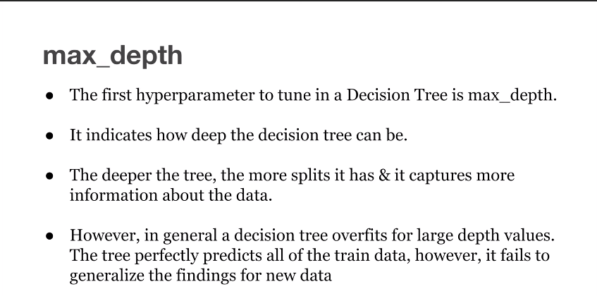
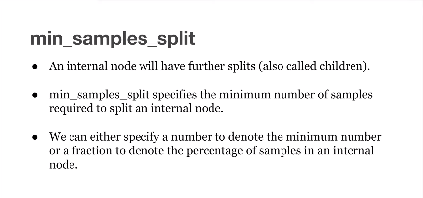
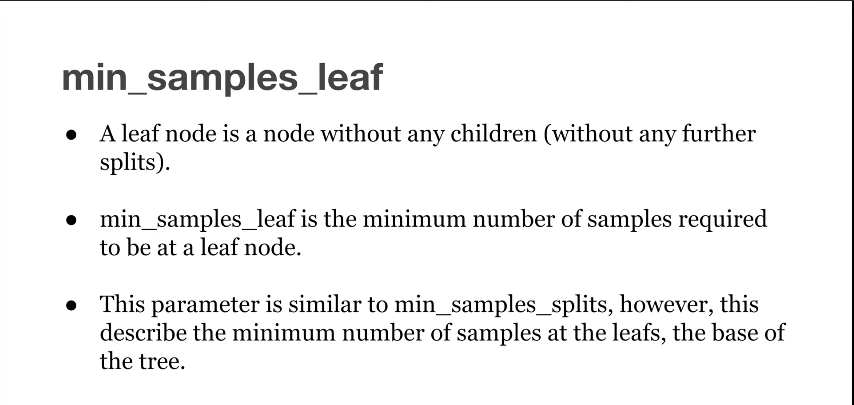
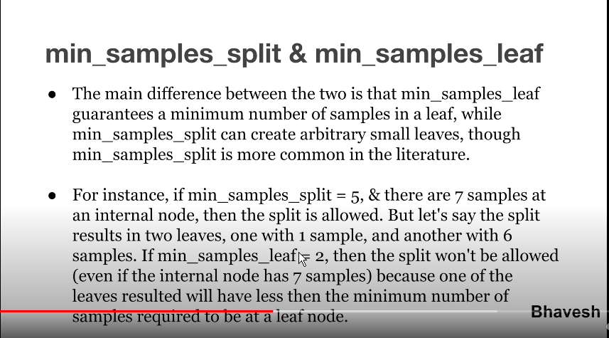
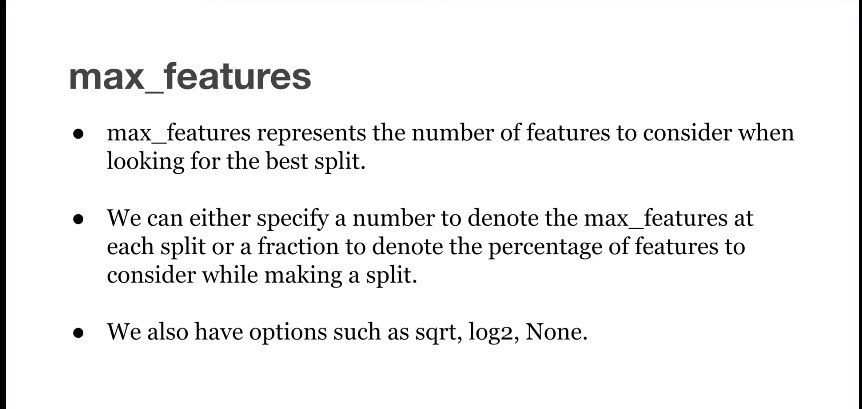
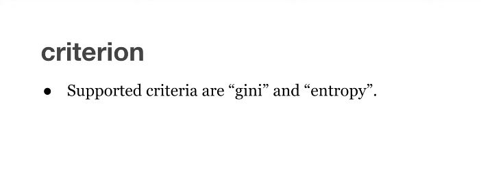

Decision Tree
====


### Introduction

   
Classification is a two-step process, learning step and prediction step, in machine learning. In the learning step, the model is developed based on given training data. In the prediction step, the model is used to predict the response for given data. Decision Tree is one of the easiest and popular classification algorithms to understand and interpret.

### Decision Tree Algorithm

   
Decision Tree algorithm belongs to the family of supervised learning algorithms. Unlike other supervised learning algorithms, the decision tree algorithm can be used for solving **regression and classification problems** too.

The goal of using a Decision Tree is to create a training model that can use to predict the class or value of the target variable by **learning simple decision rules** inferred from prior data(training data).

In Decision Trees, for predicting a class label for a record we start from the **root** of the tree. We compare the values of the root attribute with the record’s attribute. On the basis of comparison, we follow the branch corresponding to that value and jump to the next node.

### Types of Decision Trees

   
Types of decision trees are based on the type of target variable we have. It can be of two types:

1.  **Categorical Variable Decision Tree:** Decision Tree which has a categorical target variable then it called a **Categorical variable decision tree.**
2.  **Continuous Variable Decision Tree:** Decision Tree has a continuous target variable then it is called **Continuous Variable Decision Tree.**

**Example:-** Let’s say we have a problem to predict whether a customer will pay his renewal premium with an insurance company (yes/ no). Here we know that the income of customers is a significant variable but the insurance company does not have income details for all customers. Now, as we know this is an important variable, then we can build a decision tree to predict customer income based on occupation, product, and various other variables. In this case, we are predicting values for the continuous variables.

### Important Terminology related to Decision Trees

1.  **Root Node:** It represents the entire population or sample and this further gets divided into two or more homogeneous sets.
2.  **Splitting:** It is a process of dividing a node into two or more sub-nodes.
3.  **Decision Node:** When a sub-node splits into further sub-nodes, then it is called the decision node.
4.  **Leaf / Terminal Node:** Nodes do not split is called Leaf or Terminal node.
5.  **Pruning:** When we remove sub-nodes of a decision node, this process is called pruning. You can say the opposite process of splitting.
6.  **Branch / Sub-Tree:** A subsection of the entire tree is called branch or sub-tree.
7.  **Parent and Child Node:** A node, which is divided into sub-nodes is called a parent node of sub-nodes whereas sub-nodes are the child of a parent node.


Decision trees classify the examples by sorting them down the tree from the root to some leaf/terminal node, with the leaf/terminal node providing the classification of the example.

Each node in the tree acts as a test case for some attribute, and each edge descending from the node corresponds to the possible answers to the test case. This process is recursive in nature and is repeated for every subtree rooted at the new node.

### Assumptions while creating Decision Tree

   
Below are some of the assumptions we make while using Decision tree:

*   In the beginning, the whole training set is considered as the **root.**
*   Feature values are preferred to be categorical. If the values are continuous then they are discretized prior to building the model.
*   Records are **distributed recursively** on the basis of attribute values.
*   Order to placing attributes as root or internal node of the tree is done by using some statistical approach.

Decision Trees follow **Sum of Product (SOP) r**epresentation. The Sum of product (SOP) is also known as **Disjunctive Normal Form**. For a class, every branch from the root of the tree to a leaf node having the same class is conjunction (product) of values, different branches ending in that class form a disjunction (sum).

The primary challenge in the decision tree implementation is to identify which attributes do we need to consider as the root node and each level. Handling this is to know as the attributes selection. We have different attributes selection measures to identify the attribute which can be considered as the root note at each level.

### How do Decision Trees work?

   
The decision of making strategic splits heavily affects a tree’s accuracy. The decision criteria are different for classification and regression trees.

Decision trees use multiple algorithms to decide to split a node into two or more sub-nodes. The creation of sub-nodes increases the homogeneity of resultant sub-nodes. In other words, we can say that the purity of the node increases with respect to the target variable. The decision tree splits the nodes on all available variables and then selects the split which results in most homogeneous sub-nodes.

The algorithm selection is also based on the type of target variables. Let us look at some algorithms used in Decision Trees:

**ID3** → (extension of D3)  
**C4.5** → (successor of ID3)  
**CART** → (Classification And Regression Tree)  
**CHAID** → (Chi-square automatic interaction detection Performs multi-level splits when computing classification trees)  
**MARS** → (multivariate adaptive regression splines)

The ID3 algorithm builds decision trees using a top-down [greedy search](https://www.hackerearth.com/practice/algorithms/greedy/basics-of-greedy-algorithms/tutorial/) approach through the space of possible branches with no backtracking. A greedy algorithm, as the name suggests, always makes the choice that seems to be the best at that moment.

**Steps in ID3 algorithm:**

1.  It begins with the original set S as the root node.
2.  On each iteration of the algorithm, it iterates through the very unused attribute of the set S and calculates **Entropy(H)** and **Information gain(IG)** of this attribute.
3.  It then selects the attribute which has the smallest Entropy or Largest Information gain.
4.  The set S is then split by the selected attribute to produce a subset of the data.
5.  The algorithm continues to recur on each subset, considering only attributes never selected before.

### Attribute Selection Measures

   
If the dataset consists of **N** attributes then deciding which attribute to place at the root or at different levels of the tree as internal nodes is a complicated step. By just randomly selecting any node to be the root can’t solve the issue. If we follow a random approach, it may give us bad results with low accuracy.

For solving this attribute selection problem, researchers worked and devised some solutions. They suggested using some _criteria_ like :

**Entropy**,  
**Information gain,**  
**Gini index,**  
**Gain Ratio,**  
**Reduction in Variance**  
**Chi-Square**

These criteria will calculate values for every attribute. The values are sorted, and attributes are placed in the tree by following the order i.e, the attribute with a high value(in case of information gain) is placed at the root.  
While using Information Gain as a criterion, we assume attributes to be categorical, and for the Gini index, attributes are assumed to be continuous.

### **Entropy**

   
Entropy is a measure of the randomness in the information being processed. The higher the entropy, the harder it is to draw any conclusions from that information. Flipping a coin is an example of an action that provides information that is random.


From the above graph, it is quite evident that the entropy H(X) is zero when the probability is either 0 or 1. The Entropy is maximum when the probability is 0.5 because it projects perfect randomness in the data and there is no chance if perfectly determining the outcome.

> **ID3 follows the rule — A branch with an entropy of zero is a leaf node and A brach with entropy more than zero needs further splitting.**

Mathematically Entropy for 1 attribute is represented as:


Where **S → Current state, and Pi → Probability of an event _i_ of state S or Percentage of class _i_ in a node of state S.**

Mathematically Entropy for multiple attributes is represented as:


where **T→ Current state and X → Selected attribute**

### **Information Gain**

   
Information gain or **IG** is a statistical property that measures how well a given attribute separates the training examples according to their target classification. Constructing a decision tree is all about finding an attribute that returns the highest information gain and the smallest entropy.

  

[Information Gain](https://becominghuman.ai/decision-trees-in-machine-learning-f362b296594a?gi=a8ffb5170258)

Information gain is a decrease in entropy. It computes the difference between entropy before split and average entropy after split of the dataset based on given attribute values. ID3 (Iterative Dichotomiser) decision tree algorithm uses information gain.

Mathematically, IG is represented as:


In a much simpler way, we can conclude that:


[Information Gain](https://towardsdatascience.com/from-a-single-decision-tree-to-a-random-forest-b9523be65147)

Where “before” is the dataset before the split, K is the number of subsets generated by the split, and (j, after) is subset j after the split.

### Gini Index

   
You can understand the Gini index as a cost function used to evaluate splits in the dataset. It is calculated by subtracting the sum of the squared probabilities of each class from one. It favors larger partitions and easy to implement whereas information gain favors smaller partitions with distinct values.

  

Gini Index

Gini Index works with the categorical target variable “Success” or “Failure”. It performs only Binary splits.

> Higher value of Gini index implies higher inequality, higher heterogeneity.

**Steps to Calculate Gini index for a split**

1.  Calculate Gini for sub-nodes, using the above formula for success(p) and failure(q) (p²+q²).
2.  Calculate the Gini index for split using the weighted Gini score of each node of that split.

CART (Classification and Regression Tree) uses the Gini index method to create split points.

### Gain ratio

   
Information gain is biased towards choosing attributes with a large number of values as root nodes. It means it prefers the attribute with a large number of distinct values.

C4.5, an improvement of ID3, uses Gain ratio which is a modification of Information gain that reduces its bias and is usually the best option. Gain ratio overcomes the problem with information gain by taking into account the number of branches that would result before making the split. It corrects information gain by taking the intrinsic information of a split into account.

> Let us consider if we have a dataset that has users and their movie genre preferences based on variables like gender, group of age, rating, blah, blah. With the help of information gain, you split at ‘Gender’ (assuming it has the highest information gain) and now the variables ‘Group of Age’ and ‘Rating’ could be equally important and with the help of gain ratio, it will penalize a variable with more distinct values which will help us decide the split at the next level.

  

[Gain Ratio](https://towardsdatascience.com/from-a-single-decision-tree-to-a-random-forest-b9523be65147)

Where “before” is the dataset before the split, K is the number of subsets generated by the split, and (j, after) is subset j after the split.


How to calculate Gain Ratio
===========================


As we discussed in one of our article about **How and when does the Decision tree stop splitting?** Gain Ratio is  modification of information gain that reduces its bias. Gain ratio overcomes the problem with information gain by taking into account the number of branches that would result before making the split.It corrects information gain by taking the intrinsic information of a split into account.We can also say Gain Ratio will add penalty to information gain.

         
 **We already know how to calculate Gain or Information Gain**


        Where S1,S2…….Sn are the subset resulting partitioning S for Attribute A

For example:

From the below image I can say A is sunny where S1,S2…Sn are the subsets like {Yes,No}


### **Lets calculate Gain Ratio:**

We already calculated Gain in our article [Deriving Decision Tree using Entropy (ID3 approach)](https://machinewithdata.com/2020/06/17/deriving-decision-tree-using-entropy-id3-approach/)

 PFB table.


**Lets calculate Gain Ratio for Outlook:**


**Once we calculate for remaining variables below will the Gain Ratio for all variables.**


**Note:**

The attribute with the maximum gain ratio is selected as the splitting attribute


### **Reduction in Variance**

   
**Reduction in variance** is an algorithm used for continuous target variables (regression problems). This algorithm uses the standard formula of variance to choose the best split. The split with lower variance is selected as the criteria to split the population:


Above X-bar is the mean of the values, X is actual and n is the number of values.

**Steps to calculate Variance:**

1.  Calculate variance for each node.
2.  Calculate variance for each split as the weighted average of each node variance.

### **Chi-Square**

   
The acronym CHAID stands for _Chi_-squared Automatic Interaction Detector. It is one of the oldest tree classification methods. It finds out the statistical significance between the differences between sub-nodes and parent node. We measure it by the sum of squares of standardized differences between observed and expected frequencies of the target variable.

It works with the categorical target variable “Success” or “Failure”. It can perform two or more splits. Higher the value of Chi-Square higher the statistical significance of differences between sub-node and Parent node.

It generates a tree called CHAID (Chi-square Automatic Interaction Detector).

Mathematically, Chi-squared is represented as:


**Steps to Calculate Chi-square for a split:**

1.  Calculate Chi-square for an individual node by calculating the deviation for Success and Failure both
2.  Calculated Chi-square of Split using Sum of all Chi-square of success and Failure of each node of the split

### **How to avoid/counter Overfitting in Decision Trees?**

   
The common problem with Decision trees, especially having a table full of columns, they fit a lot. Sometimes it looks like the tree memorized the training data set. If there is no limit set on a decision tree, it will give you 100% accuracy on the training data set because in the worse case it will end up making 1 leaf for each observation. Thus this affects the accuracy when predicting samples that are not part of the training set.

Here are two ways to remove overfitting:

1.  Pruning Decision Trees.
2.  Random Forest

**Pruning Decision Trees**

The splitting process results in fully grown trees until the stopping criteria are reached. But, the fully grown tree is likely to overfit the data, leading to poor accuracy on unseen data.

  

[Pruning in action](https://gfycat.com/enchantedyellowishbarasinga)

In **pruning**, you trim off the branches of the tree, i.e., remove the decision nodes starting from the leaf node such that the overall accuracy is not disturbed. This is done by segregating the actual training set into two sets: training data set, D and validation data set, V. Prepare the decision tree using the segregated training data set, D. Then continue trimming the tree accordingly to optimize the accuracy of the validation data set, V.

  

[Pruning](https://www.cs.cmu.edu/~bhiksha/courses/10-601/decisiontrees/)

In the above diagram, the ‘Age’ attribute in the left-hand side of the tree has been pruned as it has more importance on the right-hand side of the tree, hence removing overfitting.

**Random Forest**

Random Forest is an example of ensemble learning, in which we combine multiple machine learning algorithms to obtain better predictive performance.

**Why the name “Random”?**

Two key concepts that give it the name random:

1.  A random sampling of training data set when building trees.
2.  Random subsets of features considered when splitting nodes.

A technique known as bagging is used to create an ensemble of trees where multiple training sets are generated with replacement.

In the bagging technique, a data set is divided into **N** samples using randomized sampling. Then, using a single learning algorithm a model is built on all samples. Later, the resultant predictions are combined using voting or averaging in parallel.

  

[Random Forest in action](https://towardsdatascience.com/why-random-forests-outperform-decision-trees-1b0f175a0b5)

### Which is better Linear or tree-based models?

   
Well, it depends on the kind of problem you are solving.

1.  If the relationship between dependent & independent variables is well approximated by a linear model, linear regression will outperform the tree-based model.
2.  If there is a high non-linearity & complex relationship between dependent & independent variables, a tree model will outperform a classical regression method.
3.  If you need to build a model that is easy to explain to people, a decision tree model will always do better than a linear model. Decision tree models are even simpler to interpret than linear regression!

### Decision Tree Classifier Building in Scikit-learn

   
The dataset that we have is a supermarket data which can be downloaded from [here](https://drive.google.com/open?id=1x1KglkvJxNn8C8kzeV96YePFnCUzXhBS).  
Load all the basic libraries.
```python
import numpy as np
import matplotlib.pyplot as plt 
import pandas as pd
```

  

Load the dataset. It consists of 5 features, `UserID`, `Gender`, `Age`, `EstimatedSalary` and `Purchased`.
```python
data = pd.read_csv('/Users/ML/DecisionTree/Social.csv')
data.head()
```

  

  

Dataset

We will take only `Age` and `EstimatedSalary` as our independent variables `X` because of other features like `Gender` and `User ID` are irrelevant and have no effect on the purchasing capacity of a person. Purchased is our dependent variable `y`.

```python
feature_cols = ['Age','EstimatedSalary']
X = data.iloc[:,[2,3]].values
y = data.iloc[:,4].values
```

  

The next step is to split the dataset into training and test.
```python
from sklearn.model_selection import train_test_split
X_train, X_test, y_train, y_test =  train_test_split(X,y,test_size = 0.25, random_state= 0)
```

  

Perform feature scaling

```python
#feature scaling
from sklearn.preprocessing import StandardScaler
sc_X = StandardScaler()
X_train = sc_X.fit_transform(X_train)
X_test = sc_X.transform(X_test)
```

  

Fit the model in the Decision Tree classifier.

```python
from sklearn.tree import DecisionTreeClassifier
classifier = DecisionTreeClassifier()
classifier = classifier.fit(X_train,y_train)
```
  

Make predictions and check accuracy.

```python

#prediction
y_pred = classifier.predict(X_test)
#Accuracy
from sklearn import metricsprint('Accuracy Score:', metrics.accuracy_score(y_test,y_pred))
```

  

The decision tree classifier gave an accuracy of 91%.

Confusion Matrix

```python
from sklearn.metrics import confusion_matrix
cm = confusion_matrix(y_test, y_pred)Output:
array([[64,  4],
       [ 2, 30]])
```
  

It means 6 observations have been classified as false.

**Let us first visualize the model prediction results.**

```python
from matplotlib.colors import ListedColormap
X_set, y_set = X_test, y_test
X1, X2 = np.meshgrid(np.arange(start = X_set[:,0].min()-1, stop= X_set[:,0].max()+1, step = 0.01),np.arange(start = X_set[:,1].min()-1, stop= X_set[:,1].max()+1, step = 0.01))
plt.contourf(X1,X2, classifier.predict(np.array([X1.ravel(), X2.ravel()]).T).reshape(X1.shape), alpha=0.75, cmap = ListedColormap(("red","green")))plt.xlim(X1.min(), X1.max())
plt.ylim(X2.min(), X2.max())for i,j in enumerate(np.unique(y_set)):
    plt.scatter(X_set[y_set==j,0],X_set[y_set==j,1], c = ListedColormap(("red","green"))(i),label = j)
plt.title("Decision Tree(Test set)")
plt.xlabel("Age")
plt.ylabel("Estimated Salary")
plt.legend()
plt.show()
```

  


**Let us also visualize the tree:**

You can use Scikit-learn’s _export_graphviz_ function to display the tree within a Jupyter notebook. For plotting trees, you also need to install Graphviz and pydotplus.

`conda install python-graphviz`  
`pip install pydotplus`

_export_graphviz_ function converts decision tree classifier into dot file and pydotplus convert this dot file to png or displayable form on Jupyter.

```python
from sklearn.tree import export_graphviz
from sklearn.externals.six import StringIO  
from IPython.display import Image  
import pydotplusdot_data = StringIO()
export_graphviz(classifier, out_file=dot_data,  
                filled=True, rounded=True,
                special_characters=True,feature_names = feature_cols,class_names=['0','1'])
graph = pydotplus.graph_from_dot_data(dot_data.getvalue())  
Image(graph.create_png())
```

  

Decision Tree.

In the decision tree chart, each internal node has a decision rule that splits the data. Gini referred to as the Gini ratio, which measures the impurity of the node. You can say a node is pure when all of its records belong to the same class, such nodes known as the leaf node.

Here, the resultant tree is unpruned. This unpruned tree is unexplainable and not easy to understand. In the next section, let’s optimize it by pruning.

**Optimizing the Decision Tree Classifier**

**criterion**: optional (default=”gini”) or Choose attribute selection measure: This parameter allows us to use the different-different attribute selection measure. Supported criteria are “gini” for the Gini index and “entropy” for the information gain.

**splitter**: string, optional (default=”best”) or Split Strategy: This parameter allows us to choose the split strategy. Supported strategies are “best” to choose the best split and “random” to choose the best random split.

**max_depth**: int or None, optional (default=None) or Maximum Depth of a Tree: The maximum depth of the tree. If None, then nodes are expanded until all the leaves contain less than min_samples_split samples. The higher value of maximum depth causes overfitting, and a lower value causes underfitting (Source).

In Scikit-learn, optimization of decision tree classifier performed by only pre-pruning. The maximum depth of the tree can be used as a control variable for pre-pruning.

```python
# Create Decision Tree classifer object
classifier = DecisionTreeClassifier(criterion="entropy", max_depth=3)
# Train Decision Tree Classifer
classifier = classifier.fit(X_train,y_train)
#Predict the response for test dataset
y_pred = classifier.predict(X_test)
# Model Accuracy, how often is the classifier correct?
print("Accuracy:",metrics.accuracy_score(y_test, y_pred))
```
  

Well, the classification rate increased to 94%, which is better accuracy than the previous model.

Now let us again visualize the pruned Decision tree after optimization.

```python
dot_data = StringIO()
export_graphviz(classifier, out_file=dot_data,  
                filled=True, rounded=True,
                special_characters=True, feature_names = feature_cols,class_names=['0','1'])
graph = pydotplus.graph_from_dot_data(dot_data.getvalue())  
Image(graph.create_png())
```
  

  

Decision Tree after pruning

This pruned model is less complex, explainable, and easy to understand than the previous decision tree model plot.


Decision Tree Hyperparameters
====






