Chapter 1: Importance of Context
---

---

## Who, what, and how

When it comes to explanatory analysis, there are a few things to think
about and be extremely clear on before visualizing any data or creating
content. First, To whom are you communicating? It is important
to have a good understanding of who your audience is and how they
perceive you.

**WHO**: - Your Audience and You

**WHAT**: - 1. Action, What you want your audience to know

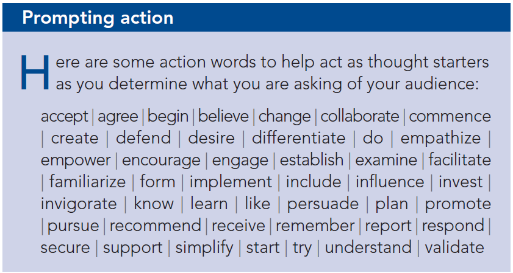

2. Mechanism, How will you communicate to your audience?

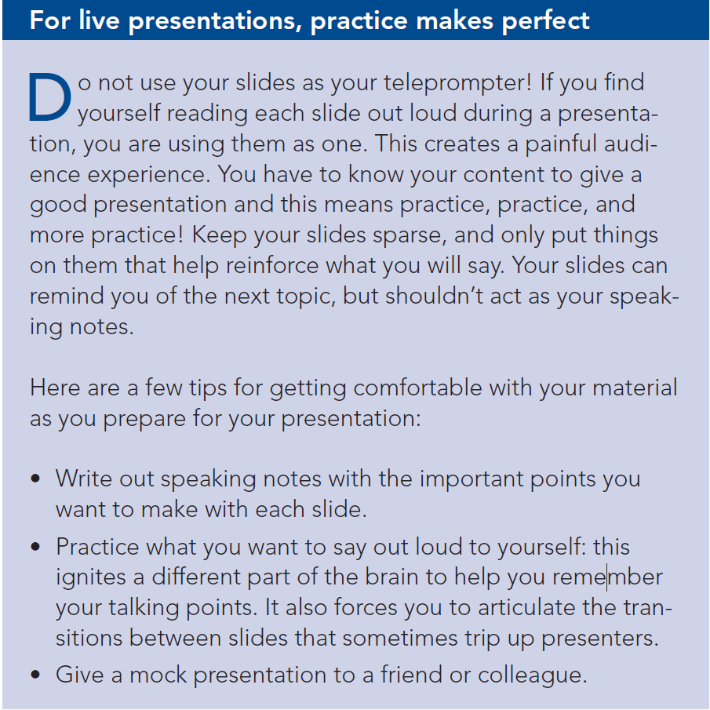

3. Tone,  What tone do you want your communication to set?

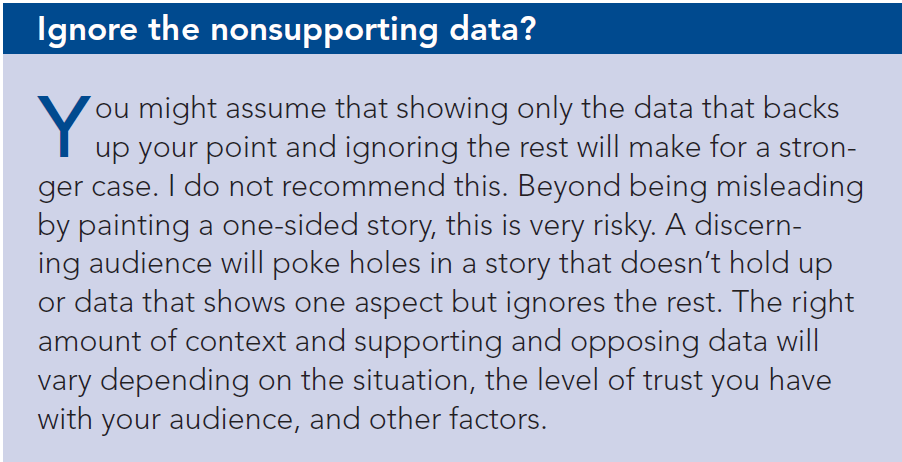

**HOW**: -

An example for budget presentation

**Who**: The budget committee that can approve funding for continuation of the summer learning program.

**What**: The summer learning program on science was a success;
please approve budget of $X to continue.

**How**: Illustrate success with data collected through the survey
conducted before and after the pilot program.

### Consulting for context: questions to ask

Think about answering these
questions for them up front:

* What background information is relevant or essential?
* Who is the audience or decision maker? What do we know about
them?
* What biases does our audience have that might make them supportive
of or resistant to our message?
* What data is available that would strengthen our case? Is our audience
familiar with this data, or is it new?
* Where are the risks: what factors could weaken our case and do
we need to proactively address them?
* What would a successful outcome look like?
* If you only had a limited amount of time or a single sentence to
tell your audience what they need to know, what would you say?

### 3‐minute story

The 3‐minute story is exactly that: if you had only three minutes
to tell your audience what they need to know, what would you
say? This is a great way to ensure you are clear on and can articulate
the story you want to tell. Being able to do this removes you
from dependence on your slides or visuals for a presentation. This
is useful in the situation where your boss asks you what you’re
working on or if you find yourself in an elevator with one of your
stakeholders and want to give her the quick rundown. Or if your
half‐hour on the agenda gets shortened to ten minutes, or to five.
If you know exactly what it is you want to communicate, you can
make it fit the time slot you’re given, even if it isn’t the one for
which you are prepared.

### Big Idea

The Big Idea boils the so‐what down even further: to a single sentence.
This is a concept that Nancy Duarte discusses in her book,
Resonate (2010). She says the Big Idea has three components:

1. It must articulate your unique point of view;
2. It must convey what’s at stake; and
3. It must be a complete sentence.

Chapter 2: Choosing an effective visuals
---

---

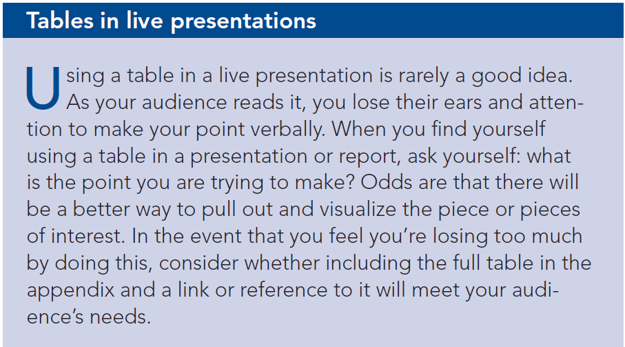

#### Heatmap Table

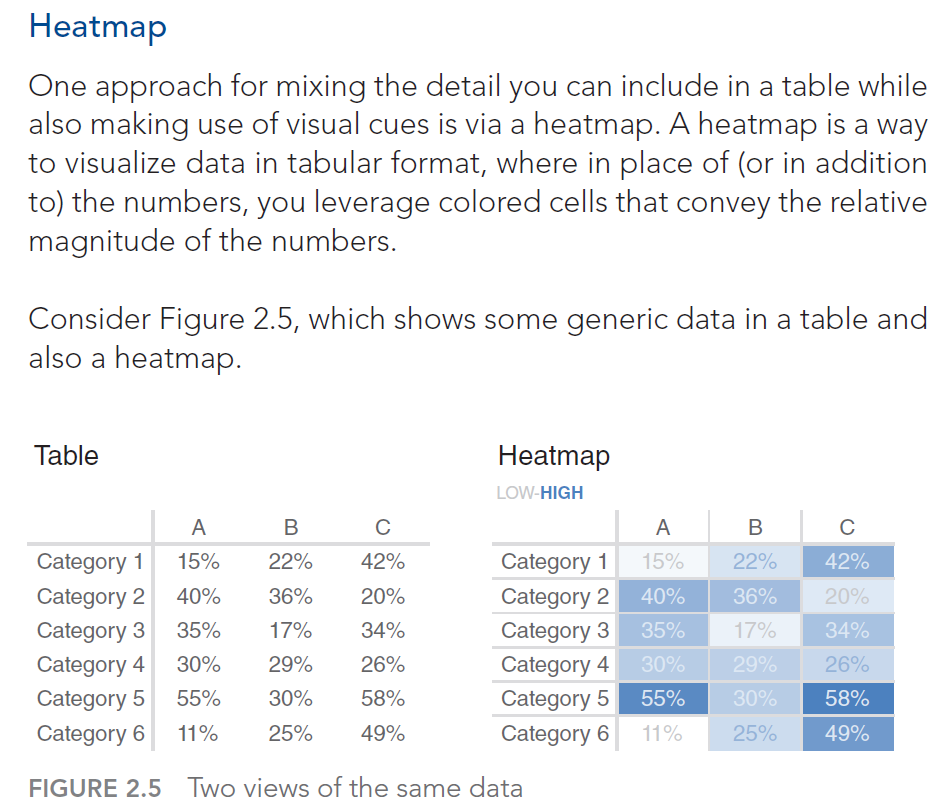

#### Graph

While tables interact with our verbal system, graphs interact with
our visual system, which is faster at processing information.

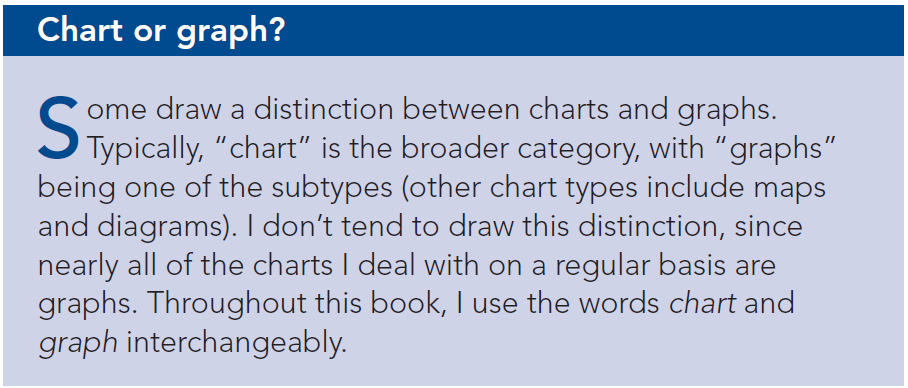
---

#### Points

1. Scatterplot

#### Line

1. Line graph

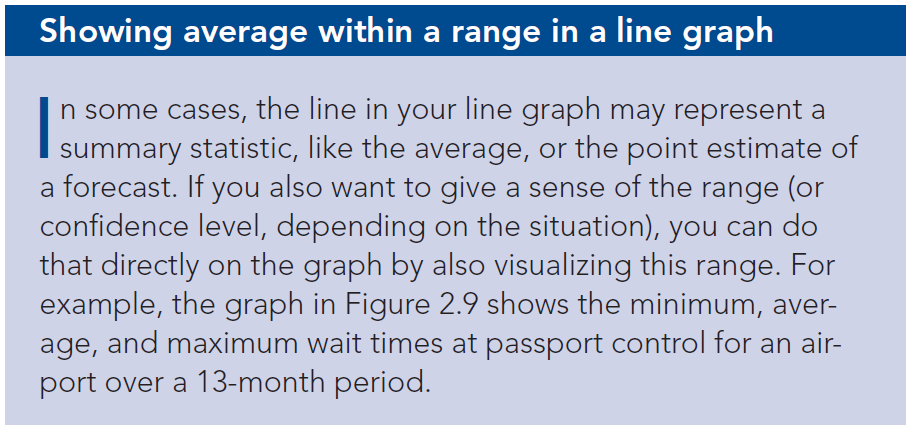

---

Chapter 3: clutter is your enemy
---

---

### Gestalt principles of visual perception

We’ll discuss six principles here: _**proximity, similarity, enclosure, closure, continuity, and connection**_. For each, I’ll show an example of
the principle applied to a table or graph.

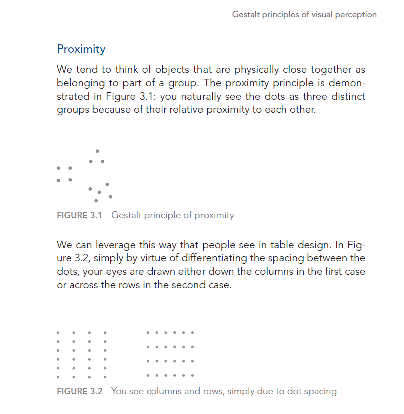

---

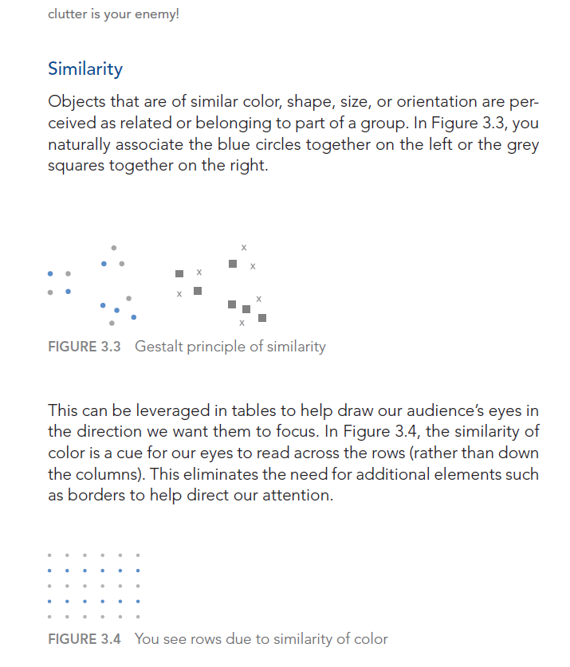

---

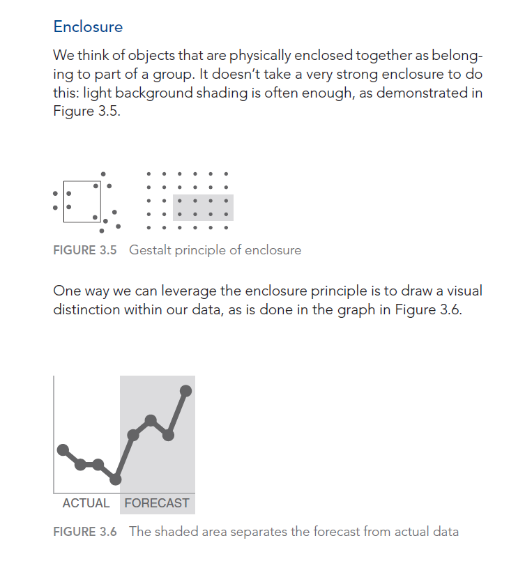

---

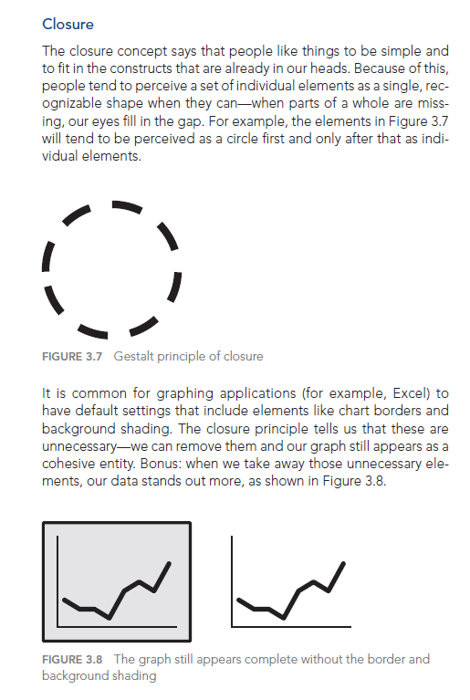

---

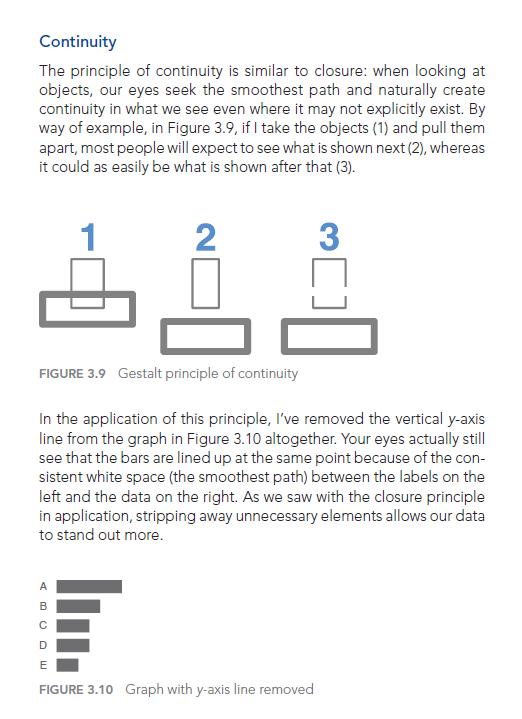

---

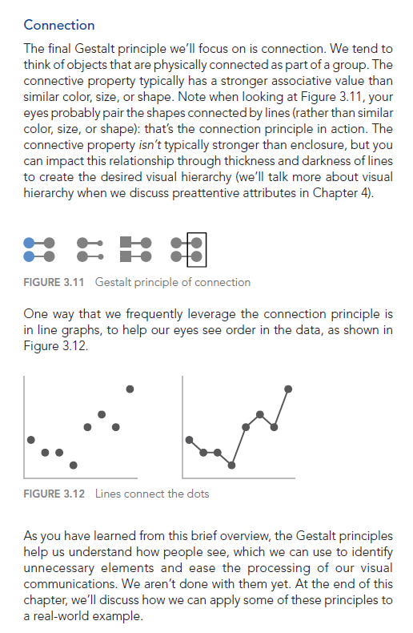

---

Chapter 4: focus your audience’s attention
---
---

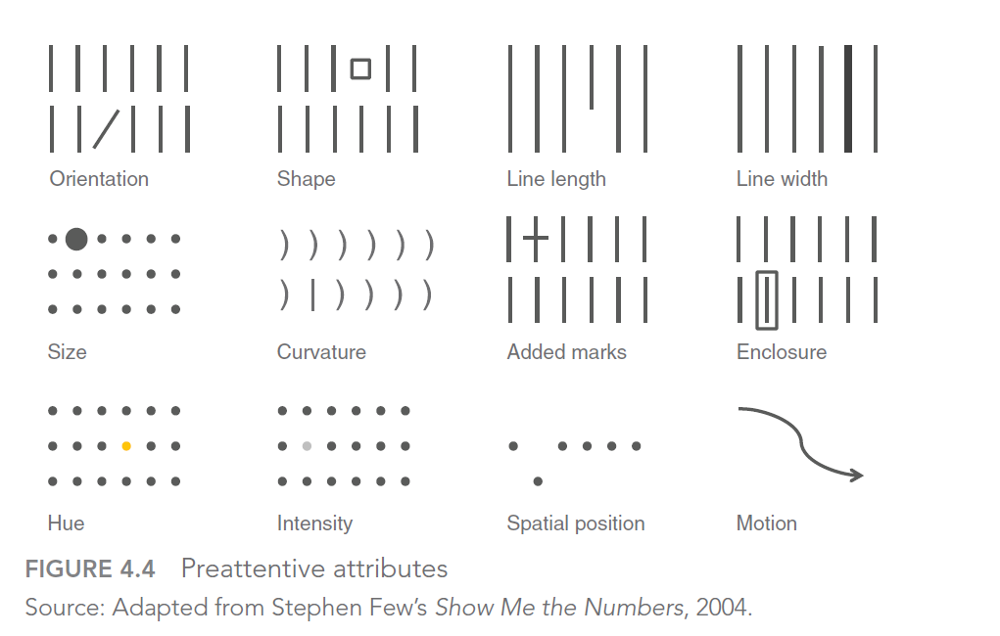

---

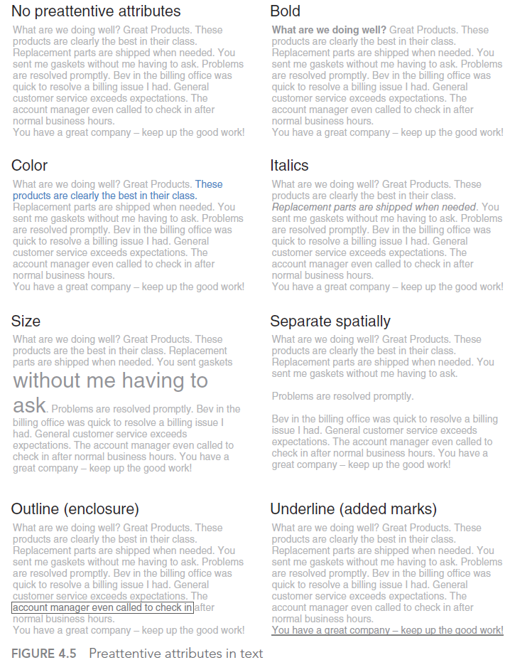

---

### Preattentive attributes in graphs

