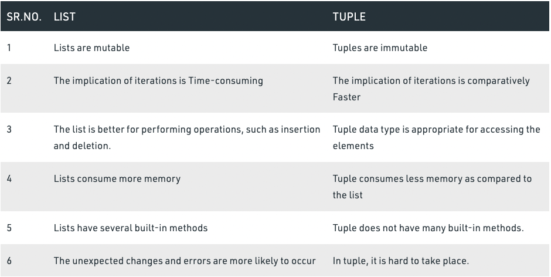
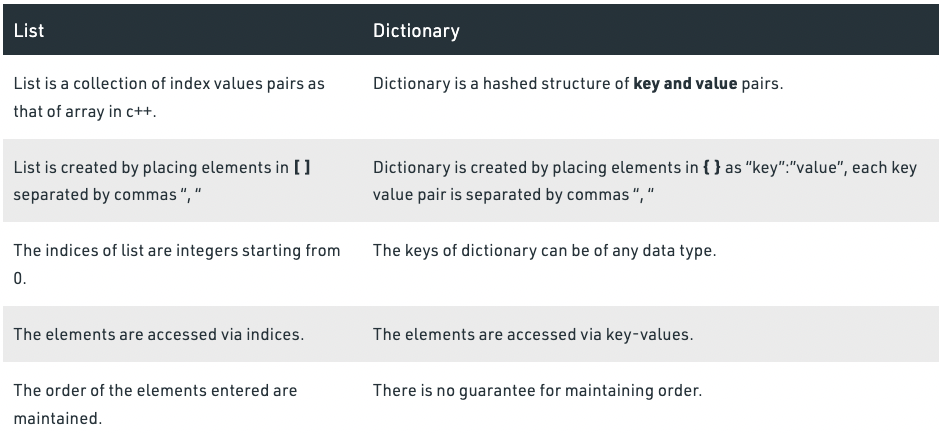

1. [[Python.pandas]]

### Things to Remember:

1. \*args and \*\*kwargs are special keyword which allows function to take variable length argument.
2. \*args passes variable number of non-keyworded arguments and on which operation of the tuple can be performed.
3. \*\*kwargs passes variable number of keyword arguments dictionary to function on which operation of a dictionary can be performed.
4. \*args and \*\*kwargs make the function flexible.

