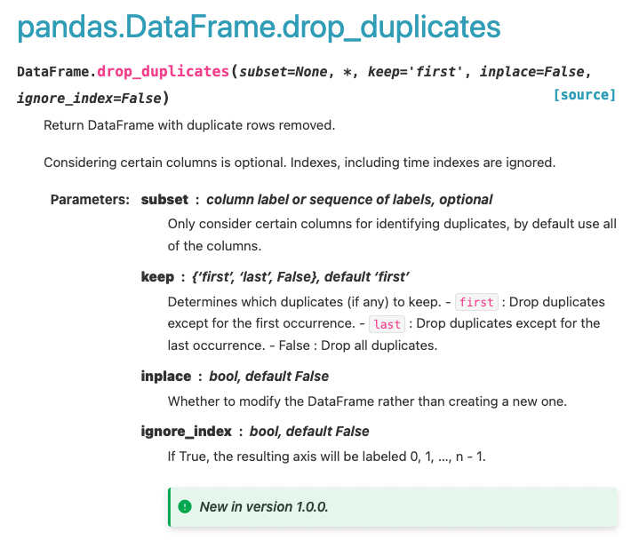

### Rename the pandas dataframe

```py
df = df.rename(columns={'oldName1': 'newName1', 'oldName2': 'newName2'})
# Or rename the existing DataFrame (rather than creating a copy) 
df.rename(columns={'oldName1': 'newName1', 'oldName2': 'newName2'}, inplace=True)
```

### Creating a dataframe pandas

```py
d = {'col1': [1, 2], 'col2': [3, 4]}
df = pd.DataFrame(data=d)
df
```

### Dropping the columns from pandas dataframe

```py
df.drop(['B', 'C'], axis=1) # Providing labels and axis
# OR
df.drop(columns=['B', 'C']) # Providing column names
```

### Removed duplicates from the pandas dataframe

```py
DataFrame.drop_duplicates(subset=None, *, keep='first', inplace=False, ignore_index=False)[source]
```


### Creating markdown from html tables

```py
import pandas as pd
html_table = """
<table>
  <tr>
    <th>Company</th>
    <th>Contact</th>
    <th>Country</th>
  </tr>
  <tr>
    <td>Alfreds Futterkiste</td>
    <td>Maria Anders</td>
    <td>Germany</td>
  </tr>
  <tr>
    <td>Centro comercial Moctezuma</td>
    <td>Francisco Chang</td>
    <td>Mexico</td>
  </tr>
  <tr>
    <td>Ernst Handel</td>
    <td>Roland Mendel</td>
    <td>Austria</td>
  </tr>
  <tr>
    <td>Island Trading</td>
    <td>Helen Bennett</td>
    <td>UK</td>
  </tr>
  <tr>
    <td>Laughing Bacchus Winecellars</td>
    <td>Yoshi Tannamuri</td>
    <td>Canada</td>
  </tr>
  <tr>
    <td>Magazzini Alimentari Riuniti</td>
    <td>Giovanni Rovelli</td>
    <td>Italy</td>
  </tr>
</table>
"""
tab_data = pd.read_html(html_table)
tab_data
x = tab_data[0]
x.to_markdown("makdown_table.md")
```