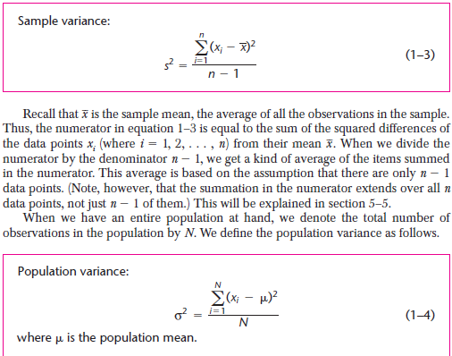
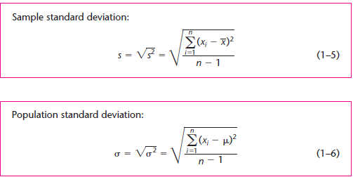
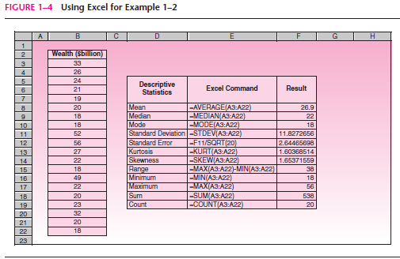
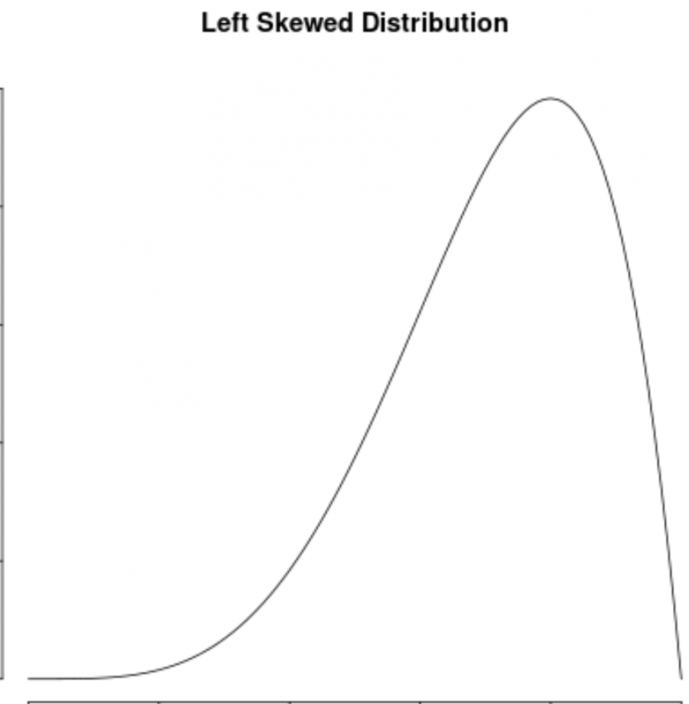
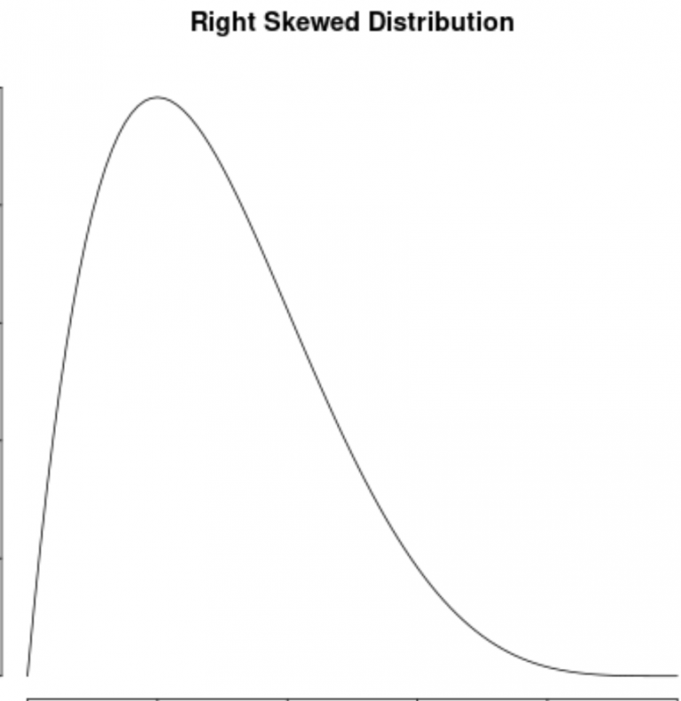
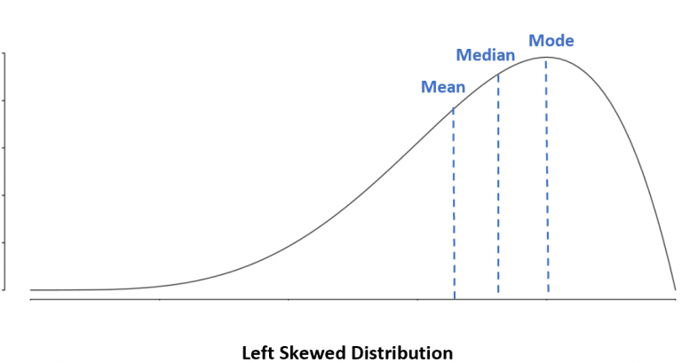
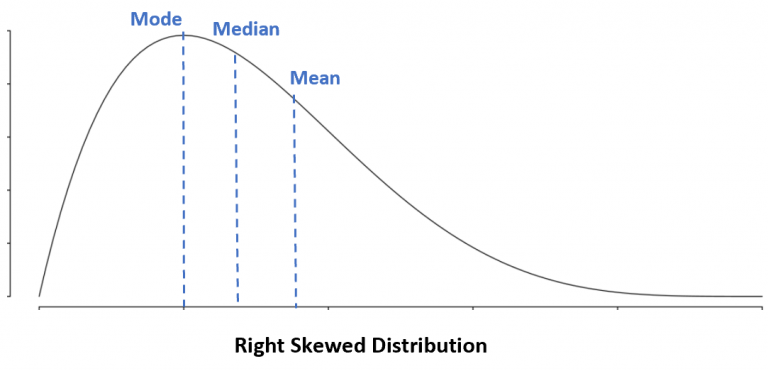
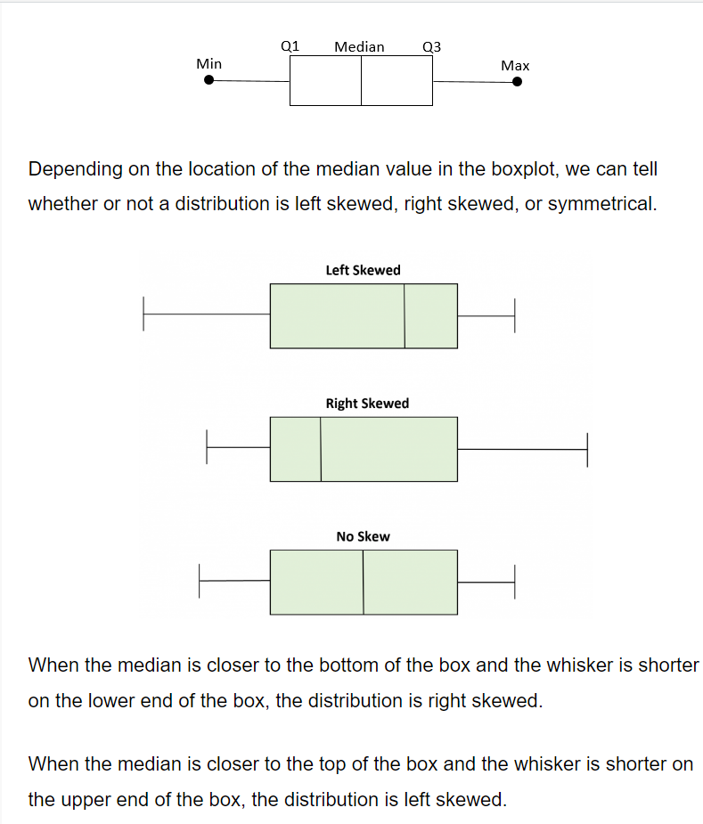
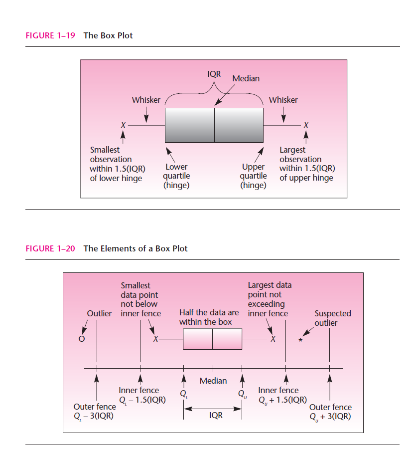

### Mean

The mean is **the average of a set of numbers**. It's also known as the arithmetic mean. To calculate the mean, you add up all the numbers in the set and divide by the total number of numbers.

### Median

In statistics, **the median is the middle value of a list of data** when arranged in order. It can be more descriptive of a data set than the average.

### Mode

In statistics, the mode is the **value that appears most often in a set of data**. It's one of the three measures of central tendency, along with the mean and median.

### Variance

### Standard Deviation

### Skewness 

is a way to describe the symmetry of a distribution.

A distribution is **left skewed** if it has a “tail” on the left side of the distribution:

A distribution is **right skewed** if it has a “tail” on the right side of the distribution:

### Properties of Skewed Distributions

The following diagrams show where the mean, median and mode are typically located in different distributions.

**Left Skewed Distribution**: Mean < Median < Mode

**Right Skewed Distribution**: Mode < Median < Mean

### Using Box Plots to Visualize Skewness

A box plot is a type of plot that displays the five number summary of a dataset, which includes:

* The minimum value
* The first quartile (the 25th percentile)
* The median value
* The third quartile (the 75th percentile)
* The maximum value
  
To make a box plot, we draw a box from the first to the third quartile. Then we draw a vertical line at the median. Lastly, we draw “whiskers” from the quartiles to the minimum and maximum value.

## Random Variable

Explaining a random variable to an interviewer involves breaking down the concept in a clear and concise manner. Here's a potential explanation:

"A random variable is a mathematical concept used in probability theory and statistics to model and quantify uncertain outcomes. It represents a numerical quantity that can take on different values depending on the outcome of a random process. This process could be the result of a random experiment or an uncertain event.

There are two types of random variables: discrete and continuous. 

1. **Discrete Random Variable:**
   * Takes on a finite or countably infinite set of distinct values.
   * Examples include the number of heads in multiple coin tosses or the outcome of rolling a six-sided die.

2. **Continuous Random Variable:**
   * Can take on any value within a range.
   * Examples include the height of a person, the temperature at a given time, or the time it takes for a computer to process a task.

Random variables are often denoted by letters (e.g., X, Y) and are characterized by their probability distribution, which describes the likelihood of each possible outcome. The probability distribution can be expressed through a probability mass function (for discrete variables) or a probability density function (for continuous variables).

Understanding random variables is crucial in analyzing and making predictions about uncertain events, allowing us to quantify the uncertainty associated with different outcomes and make informed decisions based on probability theory."

Tailor the explanation based on your audience and the specific context of the interview. If the interviewer seeks more depth, be prepared to elaborate on related concepts, such as expected value, variance, and cumulative distribution functions.