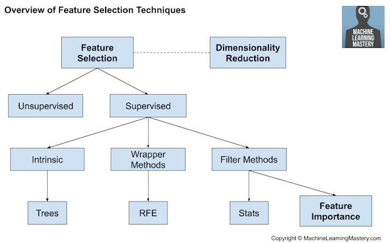

### Understanding feature selection techniques

We can summarize feature selection as follows.

* **Feature Selection**: Select a subset of input features from the dataset.
  * **Unsupervised**: Do not use the target variable (e.g. remove redundant variables).
    * Correlation
  * **Supervised**: Use the target variable (e.g. remove irrelevant variables).
    * **Wrapper**: Search for well-performing subsets of features.
      * RFE(Recursive feature elimination)
    * **Filter**: Select subsets of features based on their relationship with the target.
      * Statistical Methods
      * Feature Importance Methods
    * **Intrinsic**: Algorithms that perform automatic feature selection during training.
      * Decision Trees
  * **Dimensionality Reduction**: Project input data into a lower-dimensional feature space.

The image below provides a summary of this hierarchy of feature selection techniques.

> The difference has to do with whether features are selected based on the target variable or not. Unsupervised feature selection techniques ignores the target variable, such as methods that remove redundant variables using correlation. Supervised feature selection techniques use the target variable, such as methods that remove irrelevant variables..
> 
> Another way to consider the mechanism used to select features which may be divided into wrapper and filter methods. These methods are almost always supervised and are evaluated based on the performance of a resulting model on a hold out dataset.
>
>Wrapper feature selection methods create many models with different subsets of input features and select those features that result in the best performing model according to a performance metric. These methods are unconcerned with the variable types, although they can be computationally expensive. RFE is a good example of a wrapper feature selection method.
>
> some models contain built-in feature selection, meaning that the model will only include predictors that help maximize accuracy. In these cases, the model can pick and choose which representation of the data is best.
>
> This includes algorithms such as penalized regression models like Lasso and decision trees, including ensembles of decision trees like random forest.

### 2. Statistics for Filter-Based Feature Selection Methods
It is common to use correlation type statistical measures between input and output variables as the basis for filter feature selection.

As such, the choice of statistical measures is highly dependent upon the variable data types.

Common data types include numerical (such as height) and categorical (such as a label), although each may be further subdivided such as integer and floating point for numerical variables, and boolean, ordinal, or nominal for categorical variables.

Common input variable data types:

1. Numerical Variables
   1. Integer Variables.
   2. Floating Point Variables.
2. Categorical Variables.
   1. Boolean Variables (dichotomous).
   2. Ordinal Variables.
Nominal Variables.

### Numerical Input, Numerical Output
This is a regression predictive modeling problem with numerical input variables.

The most common techniques are to use a correlation coefficient, such as Pearson’s for a linear correlation, or rank-based methods for a nonlinear correlation.

* Pearson’s correlation coefficient (linear).
* Spearman’s rank coefficient (nonlinear)

### Numerical Input, Categorical Output
This is a classification predictive modeling problem with numerical input variables.

This might be the most common example of a classification problem,

Again, the most common techniques are correlation based, although in this case, they must take the categorical target into account.

* ANOVA correlation coefficient (linear).
* Kendall’s rank coefficient (nonlinear).