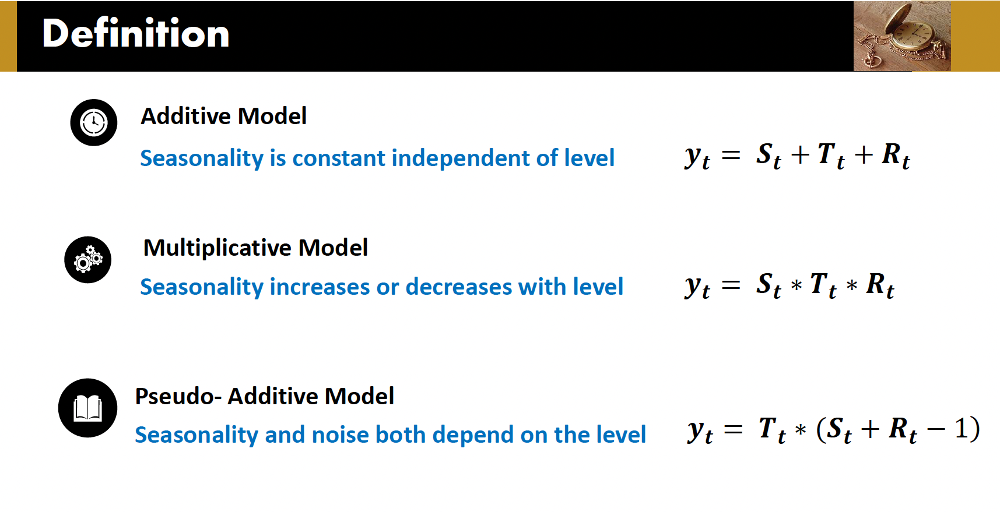
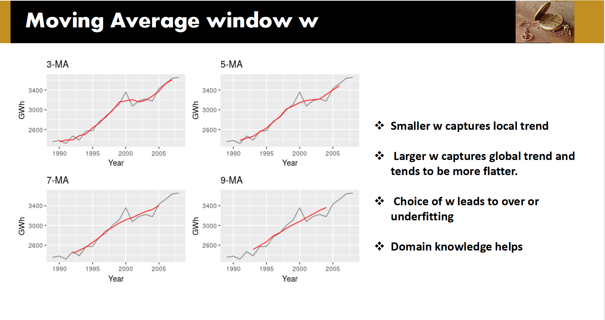

Forecasting algorithms
---

### Time Series Components

1. Level
   - The average value in the series
2. Trend
   - Increase or decrease in the series over long period of time
3. Seasonality
   - Short term variation due to seasonal factors - Regular Pattern
4. Cyclicality
   - Medium term variation repating at __*irregular*__ interval
5. Noise

### Time Series Decomposition

1. Additive
2. Multiplicative
3. Pseudo-Additive

---

There are two method to remove seasonality

1. Moving average method
   1. Centered Moving Average
      1. First and last few observations are lost
      2. Not suitable for forecasting
   2. Trailing Moving Average
      1. Uses latest information
      2. Suitable for forecasting
   3. Suppress seasonality and noise
   4. Trends become visible
   5. Depends on window width w
      1. 
2. Differencing