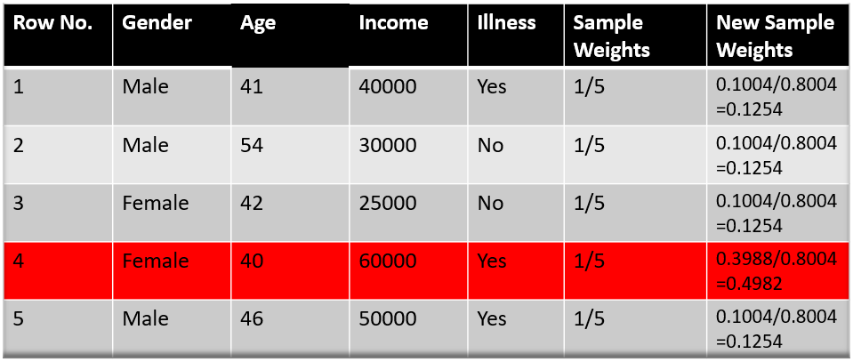

### What is the AdaBoost Algorithm?
AdaBoost also called Adaptive Boosting is a technique in Machine Learning used as an Ensemble Method. The most common algorithm used with AdaBoost is decision trees with one level that means with Decision trees with only 1 split. These trees are also called Decision Stumps.

What this algorithm does is that it builds a model and gives equal weights to all the data points. It then assigns higher weights to points that are wrongly classified. Now all the points which have higher weights are given more importance in the next model. It will keep training models until and unless a lower error is received.

### Understanding the working of AdaBoost Algorithm
Let’s start understanding what and how does this algorithm work under the hood.

**Step 1 –** The Image is shown below is the actual representation of our dataset. Since the target column is binary it is a classification problem. First of all these data points will be assigned some weights. Initially, all the weights will be equal.

The formula to calculate the sample weights is:

Where N is the total number of datapoints

Here since we have 5 data points so the sample weights assigned will be 1/5.

**Step 2 –** We start by seeing how well “Gender” classifies the samples and will see how the variables (Age, Income) classifies the samples.

We’ll create a decision stump for each of the features and then calculate the Gini Index of each tree. The tree with the lowest Gini Index will be our first stump.

Here in our dataset let’s say **Gender** has the lowest gini index so it will be our first stump.

**Step 3 –** We’ll now calculate the **“Amount of Say”** or **“Importance”** or **“Influence”** for this classifier in classifying the datapoints using this formula:

The total error is nothing, but the summation of all the sample weights of misclassified data points.

Here in our dataset let’s assume there is 1 wrong output, so our total error will be 1/5, and alpha(performance of the stump) will be:

Note: Total error will always be between 0 and 1.

0 Indicates perfect stump and 1 indicates horrible stump.

From the graph above we can see that when there is no misclassification then we have no error (Total Error = 0), so the “amount of say (alpha)” will be a large number.

When the classifier predicts half right and half wrong then the Total Error = 0.5 and the importance (amount of say) of the classifier will be 0.

If all the samples have been incorrectly classified then the error will be very high (approx. to 1) and hence our alpha value will be a negative integer.

**Step 4 –** You must be wondering why is it necessary to calculate the TE and performance of a stump? Well, the answer is very simple, we need to update the weights because if the same weights are applied to the next model, then the output received will be the same as what was received in the first model.

The wrong predictions will be given more weight whereas the correct predictions weights will be decreased. Now when we build our next model after updating the weights, more preference will be given to the points with higher weights.

After finding the importance of the classifier and total error we need to finally update the weights and for this, we use the following formula:

The amount of say (alpha) will be __*negative*__ when the sample is **correctly classified**.

The amount of say (alpha) will be **_positive_** when the sample is **miss-classified**.

There are four correctly classified samples and 1 wrong, here the **_sample weight_** of that datapoint is 1/5 and **_the amount of say/performance of the stump of Gender_** is 0.69.

New weights for correctly classified samples are:

For wrongly classified samples the updated weights will be:

**Note:** See the sign of alpha when I am putting the values, the **alpha is negative** when the data point is correctly classified, and this decreases the sample weight from 0.2 to 0.1004. It is **positive** when there is **misclassification**, and this will increase the sample weight from 0.2 to 0.3988

We know that the total sum of the sample weights must be equal to 1 but here if we sum up all the new sample weights, we will get 0.8004. To bring this sum equal to 1 we will normalize these weights by dividing all the weights by the total sum of updated weights that is 0.8004. So, after normalizing the sample weights we get this dataset and now the sum is equal to 1.

**Step 5 –** Now we need to make a new dataset to see if the errors decreased or not. For this we will remove the “sample weights” and “new sample weights” column and then based on the “new sample weights” we will divide our data points into buckets.

**Step 6 –** We are almost done, now what the algorithm does is selects random numbers from 0-1. Since incorrectly classified records have higher sample weights, the probability to select those records is very high.

Suppose the 5 random numbers our algorithm take is 0.38,0.26,0.98,0.40,0.55.

Now we will see where these random numbers fall in the bucket and according to it, we’ll make our new dataset shown below.

This comes out to be our new dataset and we see the datapoint which was wrongly classified has been selected 3 times because it has a higher weight.

**Step 9 –** Now this act as our new dataset and we need to repeat all the above steps i.e.

1. Assign **_equal weights_** to all the datapoints
2. Find the stump that does the **_best job classifying_** the new collection of samples by finding their Gini Index and selecting the one with the lowest Gini index
3. Calculate the **“Amount of Say”** and **“Total error”** to update the previous sample weights.
4. Normalize the new sample weights.

Iterate through these steps until and unless a low training error is achieved.

Suppose with respect to our dataset we have constructed 3 decision trees (DT1, DT2, DT3) in a **sequential manner**. If we send our test data now it will pass through all the decision trees and finally, we will see which class has the majority, and based on that we will do predictions
for our test dataset.