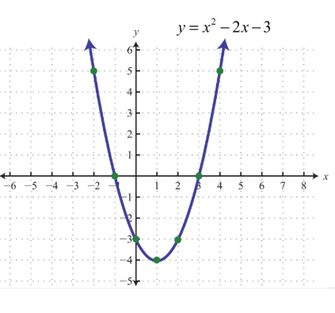

### What is the objective of Gradient Descent?
Gradient, in plain terms means slope or slant of a surface. So gradient descent literally means descending a slope to reach the lowest point on that surface. Let us imagine a two dimensional graph, such as a parabola in the figure below.

In the above graph, the lowest point on the parabola occurs at x = 1. The objective of gradient descent algorithm is to find the value of “x” such that “y” is minimum. “y” here is termed as the objective function that the gradient descent algorithm operates upon, to descend to the lowest point.

It is important to understand the above before proceeding further.

### Gradient Descent — the algorithm
I use linear regression problem to explain gradient descent algorithm. The objective of regression, as we recall from this article, is to minimize the sum of squared residuals. We know that a function reaches its minimum value when the slope is equal to 0. By using this technique, we solved the linear regression problem and learnt the weight vector. The same problem can be solved by gradient descent technique.

This algorithm is useful in cases where the optimal points cannot be found by equating the slope of the function to 0. In the case of linear regression, you can mentally map the sum of squared residuals as the function “y” and the weight vector as “x” in the parabola above.

### How to move down in steps?
This is the crux of the algorithm. The general idea is to start with a random point (in our parabola example start with a random “x”) and find a way to update this point with each iteration such that we descend the slope.

#### The steps of the algorithm are

1. Find the slope of the objective function with respect to each parameter/feature. In other words, compute the gradient of the function.
2. Pick a random initial value for the parameters. (To clarify, in the parabola example, differentiate “y” with respect to “x”. If we had more features like x1, x2 etc., we take the partial derivative of “y” with respect to each of the features.)
3. Update the gradient function by plugging in the parameter values.
4. Calculate the step sizes for each feature as : **step size = gradient * learning rate.**
5. Calculate the new parameters as : **new params = old params - step size**
6. Repeat steps 3 to 5 until gradient is almost 0.

The “learning rate” mentioned above is a flexible parameter which heavily influences the convergence of the algorithm. Larger learning rates make the algorithm take huge steps down the slope and it might jump across the minimum point thereby missing it. So, it is always good to stick to low learning rate such as 0.01. It can also be mathematically shown that gradient descent algorithm takes larger steps down the slope if the starting point is high above and takes baby steps as it reaches closer to the destination to be careful not to miss it and also be quick enough.

### Stochastic Gradient Descent (SGD)
There are a few downsides of the gradient descent algorithm. We need to take a closer look at the amount of computation we make for each iteration of the algorithm.

Say we have 10,000 data points and 10 features. The sum of squared residuals consists of as many terms as there are data points, so 10000 terms in our case. We need to compute the derivative of this function with respect to each of the features, so in effect we will be doing 10000 * 10 = 100,000 computations per iteration. It is common to take 1000 iterations, in effect we have 100,000 * 1000 = 100000000 computations to complete the algorithm. That is pretty much an overhead and hence gradient descent is slow on huge data.

Stochastic gradient descent comes to our rescue !! “Stochastic”, in plain terms means “random”.

Where can we potentially induce randomness in our gradient descent algorithm??

Yes, you might have guessed it right !! It is while selecting data points at each step to calculate the derivatives. SGD randomly picks one data point from the whole data set at each iteration to reduce the computations enormously.

It is also common to sample a small number of data points instead of just one point at each step and that is called “mini-batch” gradient descent. Mini-batch tries to strike a balance between the goodness of gradient descent and speed of SGD.

Conclusion
I hope this article was helpful in getting the hang of the algorithm. Stay tuned for more articles to come. Please leave your comments/queries below.

