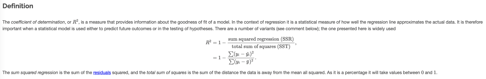
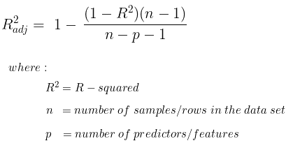
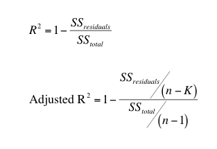
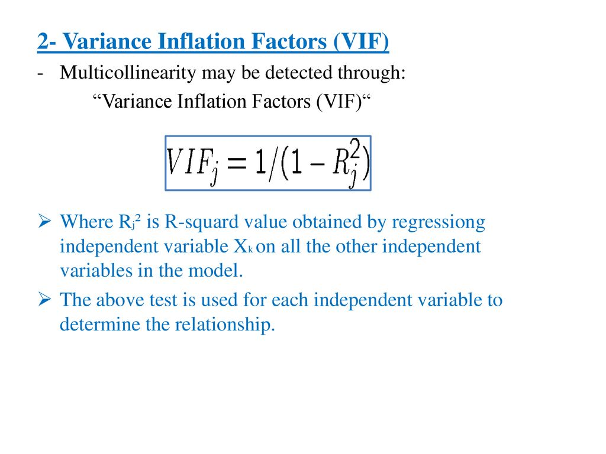
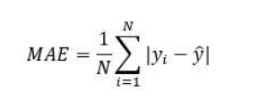
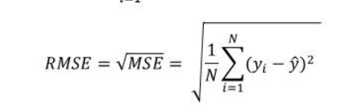

### R-Square formula

### Mean Absolute Error
---

### Mean Squared Error 
represents the average of the squared difference between the original and predicted values in the data set. It measures the variance of the residuals.

### Root Mean Squared Error 
is the square root of Mean Squared error. It measures the standard deviation of residuals.

