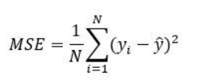

### R-Square formula

### Mean Absolute Error

---

### Mean Squared Error

represents the average of the squared difference between the original and predicted values in the data set. It measures the variance of the residuals.

### Root Mean Squared Error

is the square root of Mean Squared error. It measures the standard deviation of residuals.

### Regression Model Accuracy Metrics

Model performance metrics

In regression model, the most commonly known evaluation metrics include:

1. **R-squared (R2)**, which is the proportion of variation in the outcome that is explained by the predictor variables. In multiple regression models, R2 corresponds to the squared correlation between the observed outcome values and the predicted values by the model. The Higer the R-squared, the better the model.

2. **Root Mean Squared Error (RMSE)**, which measures the average error performed by the model in the predicting the outcome for an observation. Mathematically, the RMSE is the square root of the mean squared error (MSE), which is the average squared difference between the observed actual outcome values and the values predicted by the model. So, MSE = mean((observeds - predicteds)^2) and RMSE = sqrt(MSE). The lower the RMSE, the better the model.

3. **Residual Standard Error (RSE)**, also known as the model sigma, is a variant of the RMSE adjusted for the number of predictors in the model. The lower the RSE, the better the model. In practice, the difference between RMSE and RSE is very small, particularly for large multivariate data.

4. **Mean Absolute Error (MAE)**, like the RMSE, the MAE measures the prediction error. Mathematically, it is the average absolute difference between obsered and predicted out-comes, MAE = mean(abs(observeds - predicteds)) . MAE is less sensitive to outliers compared to RMSE.

The problem with the above metrics, is that they are sensible to the inclusion of additional variables in the model, even if those variables don’t have significant contribution in explaining the outcome. Put in other words, including additional variables in the model will always increase the R2 and reduce the RMSE. So, we need a more robust metric to guide the model choice.

Concerning R2, there is an adjusted version, called Adjusted R-squared, which adjusts the R2 for having too many variables in the model.

Additionally, there are four other important metrics - AIC, AICc, BIC and Mallows Cp - tha are commonly used for model evaluation and selection. These are an unbiased estimate of the model prediction error MSE. The lower these metrics, he better the model.

1. **AIC stands for (Akike’s Information Criteria)**, a metric developeed by the Japanese Statistician, Hirotugu Akaike, 1970. The basic idea of AIC is to penalize the inclusion of additional variables to a model. It adds a penalty that increases the error when including additional terms. The lowwer the AIC, the better the model.

2. **AICc** is a version of AIC corrected for small sample sizes.

3. **BIC (or Bayesian information criteria)** is a variant of AIC with a strong penalty for including additional variables to the model.

4. **Mallows Cp**: Avariant of AIC developed by Colin Mallows.

Linear Regression
---

1. Linear Regression Equation
2. Dependent and Independent variable
3. 