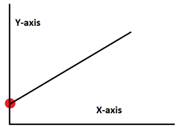
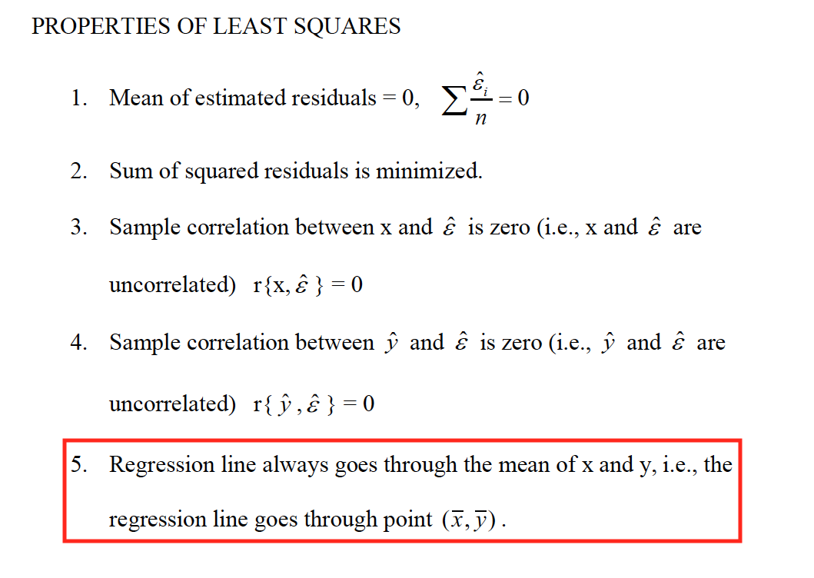

# Interpretations of linear regression
---

If all the co-efficent of X is zero in linear regression

__If X sometimes equals 0, the intercept is simply the expected mean value of Y at that value.__

### The Definition of the Constant is Correct but Misleading

The constant is often defined as the mean of the dependent variable when you set all of the independent variables in your model to zero. In a purely mathematical sense, this definition is correct. Unfortunately, it’s frequently impossible to set all variables to zero because this combination can be an impossible or irrational arrangement.

>A portion of the estimation process for the y-intercept is based on the exclusion of relevant variables from the regression model. When you leave relevant variables out, this can produce bias in the model. Bias exists if the residuals have an overall positive or negative mean. In other words, the model tends to make predictions that are systematically too high or too low. The constant term prevents this overall bias by forcing the residual mean to equal zero.

> Imagine that you can move the regression line up or down to the point where the residual mean equals zero. For example, if the regression produces residuals with a positive average, just move the line up until the mean equals zero. This process is how the constant ensures that the regression model satisfies the critical assumption that the residual average equals zero. However, this process does not focus on producing a y-intercept that is meaningful for your study area. Instead, it focuses entirely on providing that mean of zero.

>The constant ensures the residuals don’t have an overall bias, but that might make it meaningless.

### interpretation of negative intercept in regression model
>Depending on your dependent/outcome variable, a negative value for your constant/intercept should not be a cause for concern. This simply means that the expected value on your dependent variable will be less than 0 when all independent/predictor variables are set to 0.

### The Seven Classical OLS Assumptions
Like many statistical analyses, ordinary least squares (OLS) regression has underlying assumptions. When these classical assumptions for linear regression are true, ordinary least squares produces the best estimates. However, if some of these assumptions are not true, you might need to employ remedial measures or use other estimation methods to improve the results.

Many of these assumptions describe properties of the error term. Unfortunately, the error term is a population value that we’ll never know. Instead, we’ll use the next best thing that is available—the residuals. Residuals are the sample estimate of the error for each observation.

Residuals = Observed value – the fitted value

When it comes to checking OLS assumptions, assessing the residuals is crucial!

There are seven classical OLS assumptions for linear regression. The first six are mandatory to produce the best estimates. While the quality of the estimates does not depend on the seventh assumption, analysts often evaluate it for other important reasons that I’ll cover.

### OLS Assumption 1: The regression model is linear in the coefficients and the error term
This assumption addresses the functional form of the model. In statistics, a regression model is linear when all terms in the model are either the constant or a parameter multiplied by an independent variable. You build the model equation only by adding the terms together. These rules constrain the model to one type:

Y =\beta _{0} + \beta _{1}X_{1} + \beta _{2}X_{2} + \cdots + \beta _{k}X_{k} + \epsilon

In the equation, the betas (βs) are the parameters that OLS estimates. Epsilon (ε) is the random error.

In fact, the defining characteristic of linear regression is this functional form of the parameters rather than the ability to model curvature. Linear models can model curvature by including nonlinear variables such as polynomials and transforming exponential functions.

To satisfy this assumption, the correctly specified model must fit the linear pattern.

Related posts: The Difference Between Linear and Nonlinear Regression and How to Specify a Regression Model

### OLS Assumption 2: The error term has a population mean of zero
The error term accounts for the variation in the dependent variable that the independent variables do not explain. Random chance should determine the values of the error term. For your model to be unbiased, the average value of the error term must equal zero.

Suppose the average error is +7. This non-zero average error indicates that our model systematically underpredicts the observed values. Statisticians refer to systematic error like this as bias, and it signifies that our model is inadequate because it is not correct on average.

Stated another way, we want the expected value of the error to equal zero. If the expected value is +7 rather than zero, part of the error term is predictable, and we should add that information to the regression model itself. We want only random error left for the error term.

You don’t need to worry about this assumption when you include the constant in your regression model because it forces the mean of the residuals to equal zero. For more information about this assumption, read my post about the regression constant.

### OLS Assumption 3: All independent variables are uncorrelated with the error term
If an independent variable is correlated with the error term, we can use the independent variable to predict the error term, which violates the notion that the error term represents unpredictable random error. We need to find a way to incorporate that information into the regression model itself.

This assumption is also referred to as exogeneity. When this type of correlation exists, there is endogeneity. Violations of this assumption can occur because there is simultaneity between the independent and dependent variables, omitted variable bias, or measurement error in the independent variables.

Violating this assumption biases the coefficient estimate. To understand why this bias occurs, keep in mind that the error term always explains some of the variability in the dependent variable. However, when an independent variable correlates with the error term, OLS incorrectly attributes some of the variance that the error term actually explains to the independent variable instead. For more information about violating this assumption, read my post about confounding variables and omitted variable bias.

Related post: What are Independent and Dependent Variables?

### OLS Assumption 4: Observations of the error term are uncorrelated with each other
One observation of the error term should not predict the next observation. For instance, if the error for one observation is positive and that systematically increases the probability that the following error is positive, that is a positive correlation. If the subsequent error is more likely to have the opposite sign, that is a negative correlation. This problem is known both as serial correlation and autocorrelation. Serial correlation is most likely to occur in time series models.

For example, if sales are unexpectedly high on one day, then they are likely to be higher than average on the next day. This type of correlation isn’t an unreasonable expectation for some subject areas, such as inflation rates, GDP, unemployment, and so on.

Assess this assumption by graphing the residuals in the order that the data were collected. You want to see randomness in the plot. In the graph for a sales model, there is a cyclical pattern with a positive correlation.

Residuals versus order plot to check the OLS assumption for no serial correlation.
As I’ve explained, if you have information that allows you to predict the error term for an observation, you must incorporate that information into the model itself. To resolve this issue, you might need to add an independent variable to the model that captures this information. Analysts commonly use distributed lag models, which use both current values of the dependent variable and past values of independent variables.

For the sales model above, we need to add variables that explains the cyclical pattern.

Serial correlation reduces the precision of OLS estimates. Analysts can also use time series analysis for time dependent effects.

An alternative method for identifying autocorrelation in the residuals is to assess the autocorrelation function, which is a standard tool in time series analysis.

Related post: Introduction to Time Series Analysis

### OLS Assumption 5: The error term has a constant variance (no heteroscedasticity)
The variance of the errors should be consistent for all observations. In other words, the variance does not change for each observation or for a range of observations. This preferred condition is known as homoscedasticity (same scatter). If the variance changes, we refer to that as heteroscedasticity (different scatter).

The easiest way to check this assumption is to create a residuals versus fitted value plot. On this type of graph, heteroscedasticity appears as a cone shape where the spread of the residuals increases in one direction. In the graph below, the spread of the residuals increases as the fitted value increases.

Residuals by fitted values plot that displays heteroscedasticity, which violates an OLS assumption.
Heteroscedasticity reduces the precision of the estimates in OLS linear regression.

Related post: Heteroscedasticity in Regression Analysis

Note: When assumption 4 (no autocorrelation) and 5 (homoscedasticity) are both true, statisticians say that the error term is independent and identically distributed (IID) and refer to them as spherical errors.

### OLS Assumption 6: No independent variable is a perfect linear function of other explanatory variables
Perfect correlation occurs when two variables have a Pearson’s correlation coefficient of +1 or -1. When one of the variables changes, the other variable also changes by a completely fixed proportion. The two variables move in unison.

Perfect correlation suggests that two variables are different forms of the same variable. For example, games won and games lost have a perfect negative correlation (-1). The temperature in Fahrenheit and Celsius have a perfect positive correlation (+1).

Ordinary least squares cannot distinguish one variable from the other when they are perfectly correlated. If you specify a model that contains independent variables with perfect correlation, your statistical software can’t fit the model, and it will display an error message. You must remove one of the variables from the model to proceed.

Perfect correlation is a show stopper. However, your statistical software can fit OLS regression models with imperfect but strong relationships between the independent variables. If these correlations are high enough, they can cause problems. Statisticians refer to this condition as multicollinearity, and it reduces the precision of the estimates in OLS linear regression.

Related post: Multicollinearity in Regression Analysis: Problems, Detection, and Solutions

### OLS Assumption 7: The error term is normally distributed (optional)
OLS does not require that the error term follows a normal distribution to produce unbiased estimates with the minimum variance. However, satisfying this assumption allows you to perform statistical hypothesis testing and generate reliable confidence intervals and prediction intervals.

The easiest way to determine whether the residuals follow a normal distribution is to assess a normal probability plot. If the residuals follow the straight line on this type of graph, they are normally distributed. They look good on the plot below!

Normal probability plot to assess whether the residuals follow a normal distribution and satisfy the OLS assumption.
If you need to obtain p-values for the coefficient estimates and the overall test of significance, check this assumption!

