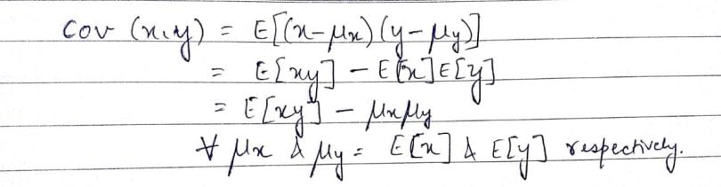
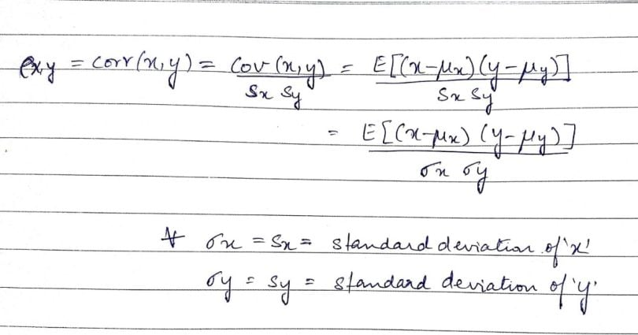

### Covariance and correlation

Covariance is an indicator of the extent to which 2 random variables are dependent on each other. A higher number denotes higher dependency. Correlation is a statistical measure that indicates how strongly two variables are related. The value of covariance lies in the range of -∞ and +∞

Covariance indicates the direction of the linear relationship between variables while correlation measures both the strength and direction of the linear relationship between two variables. Correlation is a function of the covariance

### Standard Error and margin of error

A margin of error is a statistical measure that accounts for the degree of error received from the outcome of your research sample. On the other hand, standard error measures the accuracy of the representation of the population sample to the mean using the standard deviation of the data set.

How do you find margin of error from standard error?
It is calculated as:
$$
Standard Error = s / √n.
$$

$$
Margin of Error = z*(s/√n)
$$

$$
Confidence Interval = x +/- z*(s/√n)
$$

### Type 1 and Type 2 error
A type I error (false-positive) occurs if an investigator rejects a null hypothesis that is actually true in the population; a type II error (false-negative) occurs if the investigator fails to reject a null hypothesis that is actually false in the population.

### What is Type 1 and Type 2 error example?

Type I error (false positive): the test result says you have coronavirus, but you actually don't. Type II error (false negative): the test result says you don't have coronavirus, but you actually do