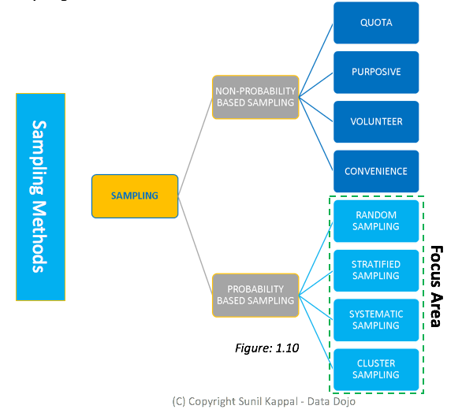
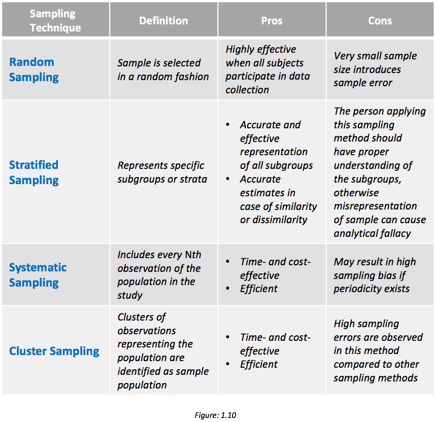

### Sampling Techniques
---

|    | Sampling method                              | Description                                                                                                                                           | Example                                                                                                                                                      |
|---:|:---------------------------------------------|:------------------------------------------------------------------------------------------------------------------------------------------------------|:-------------------------------------------------------------------------------------------------------------------------------------------------------------|
|  0 | Random sampling (aka simple random sampling) | Gathering a representative sample from a population where each member in the population has an equal chance of being selected.                        | Using a random number generator to select students in a class to complete a task.                                                                            |
|  1 | Stratified sampling                          | Smaller groups or strata within the sample are represented proportionally to the population.                                                          | Finding out a favourite soap opera from different age categories of people in a year group.                                                                  |
|  2 | Systematic sampling                          | Every member in the population is given a number. After the first member is chosen at random, the remaining members are chosen from a given interval. | A list of people with their first names in alphabetical order are numbered. The 5th person is chosen randomly, followed by every subsequent 8th person.      |
|  3 | Non random sampling                          | Convenience sampling is used for ease of data collection. Volunteers usually collect data.                                                            | Asking people at a given location about how long their commute to work is.                                                                                   |
|  4 | Capture recapture                            | Collecting a sample of data from one location at different points in time, marking the individuals to estimate a population size.                     | A sample of woodlice were captured, marked and released. Another sample of woodlice was captured 5 days later and the number of marked woodlice was counted. |

---

---

