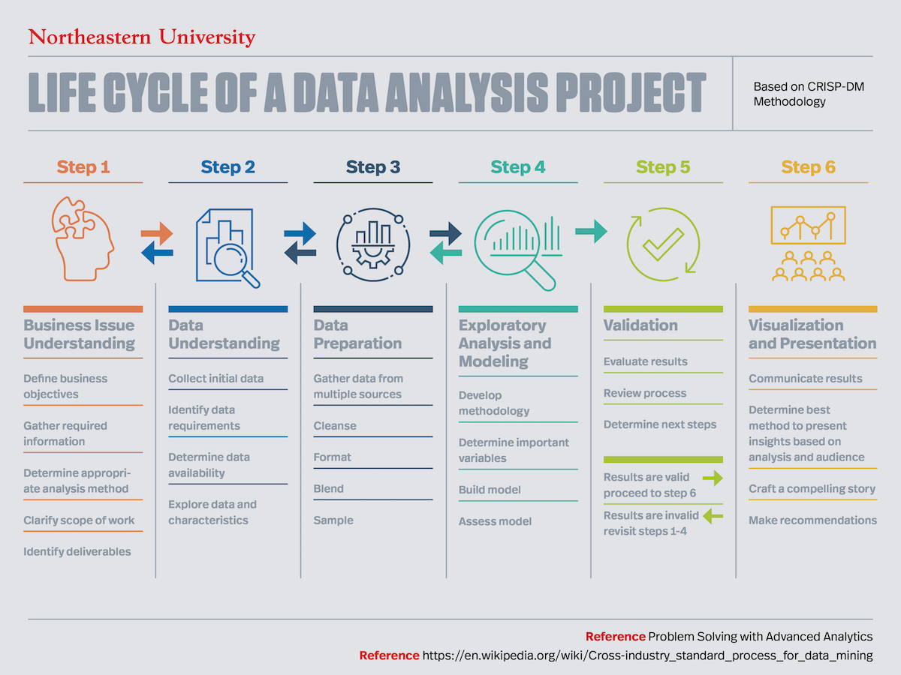
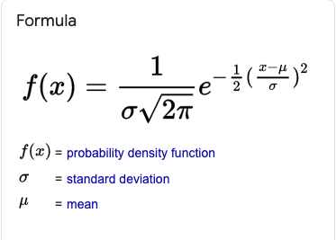
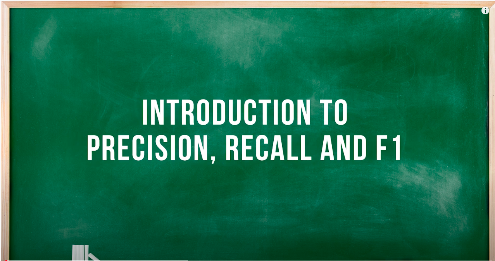

Data Science Question List
---

### What Does Cross-Validation Mean?

Cross-validation is a technique that is used for the assessment of how the results of statistical analysis generalize to an independent data set. Cross-validation is largely used in settings where the target is prediction and it is necessary to estimate the accuracy of the performance of a predictive model. The prime reason for the use of cross-validation rather than conventional validation is that there is not enough data available for partitioning them into separate training and test sets (as in conventional validation). This results in a loss of testing and modeling capability.

Cross-validation is also known as rotation estimation.

### Explain the steps for a Data analytics project



1. Understand the business issue
2. Understand your data set
3. Prepare the data
4. Perform exploratory analysis and modeling
5. Validate your data
6. Visualize and present your findings

### Discuss Artificial Neural Networks

An artificial neural network (ANN) is the piece of a computing system designed to simulate the way the human brain analyzes and processes information. It is the foundation of artificial intelligence (AI) and solves problems that would prove impossible or difficult by human or statistical standards.

### What is Back Propagation?

backward propagation of errors

> Backpropagation, short for "backward propagation of errors," is an algorithm for supervised learning of artificial neural networks using gradient descent. ... Partial computations of the gradient from one layer are reused in the computation of the gradient for the previous layer.

Back-propagation is just a way of propagating the total loss back into the neural network to know how much of the loss every node is responsible for, and subsequently updating the weights in such a way that minimizes the loss by giving the nodes with higher error rates lower weights and vice versa.

### What is a Random Forest?


Random forest, like its name implies, consists of a large number of individual decision trees that operate as an ensemble. Each individual tree in the random forest spits out a class prediction and the class with the most votes becomes our model’s prediction

### What is the importance of having a selection bias?

Selection Bias occurs when there is no appropriate randomization acheived while selecting individuals, groups or data to be analysed.Selection bias implies that the obtained sample does not exactly represent the population that was actually intended to be analyzed.Selection bias consists of Sampling Bias, Data, Attribute and Time Interval.

### Explain the difference between Data Science and Data Analytics

Data analytics is more specific and concentrated than data science. Data analytics focuses more on viewing the historical data in context while data science focuses more on machine learning and predictive modeling. ... On the other hand, data analytics involves a few different branches of broader statistics and analysis.

### What are the important libraries of Python that are used in Data Science?

* TensorFlow.
* NumPy.
* SciPy.
* Matplotlib.
* Pandas.
* Keras.
* SciKit-Learn.
* Statsmodels.
* Plotly
* Seaborn
  
### What is Interpolation and Extrapolation?

Estimating a value from 2 known values from a list of values is Interpolation. Extrapolation is approximating a value by extending a known set of values or facts. ... Interpolation is an estimation of a value within two known values in a sequence of values.

### How can the outlier values be treated?

### How often should an algorithm be updated?

It never happens that the final ML model deployed once takes away the worries forever and keeps giving accurate predictions.

Why is that? Lets figure out below:

1. Model Drift:
To understand this, let us recall one of the most critical assumptions in ML modelling — train and test dataset should belong to similar distribution. And, the model will be good if the new data is similar to the data observed in the past on which the model was trained on.
So, we understand that if test data distribution deviates from that of train data, the model will not hold good. But what could be the possible reasons for such deviation. Well, it can be attributed to many reasons depending on the business case, e.g. change in consumer preferences, fast moving competitive space, geographic shift, economic conditions etc.
Hence, the drifting data distribution calls for an ongoing process of periodically checking the validity of old model. In short, it is critical to keep your machine learning model updated; but the key is when? We will discuss this and a lot more as we proceed, so stay tuned.

2. Robustness:
   People/entities that get affected by the outcome of the ML models may deliberately alter their response in order to send spurious input to the model, thereby escaping the impact of the model predictions. For example, the models such as fraud detection, cyber-security etc receive manipulated and distorted inputs which cause model to output misclassified predictions. Such type of adversaries also drives down the model performance.
3. When ground truth is not available at the time of model training:
   In most of the machine learning models, the ground truth labels are not available to train the model. For example, target variable which captures the response of the end user is not known. In that case, your best bet could be to mock the user action based on certain set of rules coming from business understanding or leverage the open source dataset to initiate model training. But, this model might not necessarily represent the actual data and hence will not perform well until a burn-in period where it starts picking (aka learning) the true actions of the end user.

What all comes under the scope of model retraining?

* Updating the model parameters?
* Reiterating over the hyper-parameter search space
* Re-running the model selection pipeline across the candidate pool of algorithms
* If that also does not uptick the model performance, then do we need to introduce new features into the model, maybe re-do the feature engineering and selection pipeline?

Lets look at some of the ways to assess the distribution drift:

* **Histogram**: A quick way to visualize the comparison is to draw the histogram — the degree of overlap between the two histograms gives a measure of similarity.
* **K-S statistic**: To check if the upcoming new data belongs to the same distribution as that of training data.
* **Target Distribution**: One quick way to check the consistent predictive power of the ML model is to examine the distribution of the target variable. For example, if your training dataset is imbalanced with 99% data belonging to class 1 and remaining 1% to class 0. And, the predictions reflect this distribution to be around 90%-10%, then it should be treated as an alert for further investigation.
* **Correlation**: Monitoring pairwise correlations between individual predictors will help bring out the underlying drift

### Define the term deep learning

Deep learning is a type of machine learning and artificial intelligence (AI) that imitates the way humans gain certain types of knowledge. Deep learning is an important element of data science, which includes statistics and predictive modeling.

### What is Normal Distribution



In probability theory, a normal distribution is a type of continuous probability distribution for a real-valued random variable

### Which language is best for text analytics? R or Python?

Python

### Explain the benefits of using statistics by Data Scientists

Get meaningful insight from data

### Name various types of Deep Learning Frameworks

* TensorFlow. Google's open-source platform TensorFlow is perhaps the most popular tool for Machine Learning and Deep Learning. ...
* PyTorch. PyTorch is an open-source Deep Learning framework developed by Facebook. ...
* Keras. ...
* Sonnet. ...
* MXNet. ...
* Swift for TensorFlow. ...
* Gluon. ...
* DL4J.

### What is skewed Distribution & uniform distribution?

Skewed distribution is a condition when one side (either right or left) of the graph has more dataset in comparison to the other side. Uniform distribution is a condition when all the observations in a dataset are equally spread across the range of distribution.

### What is reinforcement learning?

Reinforcement learning is an area of Machine Learning. It is about taking suitable action to maximize reward in a particular situation. ... In the absence of a training dataset, it is bound to learn from its experience. Example: The problem is as follows: We have an agent and a reward, with many hurdles in between

### What is precision?

Precision is defined as the number of true positives divided by the number of true positives plus the number of false positives. ... While recall expresses the ability to find all relevant instances in a dataset, precision expresses the proportion of the data points our model says was relevant actually were relevant.

### Do you prefer Python or R for text analytics?

Python

### What is Cluster Sampling?

Cluster sampling is a probability sampling method in which you divide a population into clusters, such as districts or schools, and then randomly select some of these clusters as your sample. ... In single-stage sampling, you collect data from every unit within the selected clusters.

### Regression Model Accuracy Metrics

Model performance metrics

In regression model, the most commonly known evaluation metrics include:

1. **R-squared (R2)**, which is the proportion of variation in the outcome that is explained by the predictor variables. In multiple regression models, R2 corresponds to the squared correlation between the observed outcome values and the predicted values by the model. The Higer the R-squared, the better the model.

2. **Root Mean Squared Error (RMSE)**, which measures the average error performed by the model in the predicting the outcome for an observation. Mathematically, the RMSE is the square root of the mean squared error (MSE), which is the average squared difference between the observed actual outcome values and the values predicted by the model. So, MSE = mean((observeds - predicteds)^2) and RMSE = sqrt(MSE). The lower the RMSE, the better the model.

3. **Residual Standard Error (RSE)**, also known as the model sigma, is a variant of the RMSE adjusted for the number of predictors in the model. The lower the RSE, the better the model. In practice, the difference between RMSE and RSE is very small, particularly for large multivariate data.

4. **Mean Absolute Error (MAE)**, like the RMSE, the MAE measures the prediction error. Mathematically, it is the average absolute difference between obsered and predicted out-comes, MAE = mean(abs(observeds - predicteds)) . MAE is less sensitive to outliers compared to RMSE.

The problem with the above metrics, is that they are sensible to the inclusion of additional variables in the model, even if those variables don’t have significant contribution in explaining the outcome. Put in other words, including additional variables in the model will always increase the R2 and reduce the RMSE. So, we need a more robust metric to guide the model choice.

Concerning R2, there is an adjusted version, called Adjusted R-squared, which adjusts the R2 for having too many variables in the model.

Additionally, there are four other important metrics - AIC, AICc, BIC and Mallows Cp - tha are commonly used for model evaluation and selection. These are an unbiased estimate of the model prediction error MSE. The lower these metrics, he better the model.

1. **AIC stands for (Akike’s Information Criteria)**, a metric developeed by the Japanese Statistician, Hirotugu Akaike, 1970. The basic idea of AIC is to penalize the inclusion of additional variables to a model. It adds a penalty that increases the error when including additional terms. The lowwer the AIC, the better the model.

2. **AICc** is a version of AIC corrected for small sample sizes.

3. **BIC (or Bayesian information criteria)** is a variant of AIC with a strong penalty for including additional variables to the model.

4. **Mallows Cp**: Avariant of AIC developed by Colin Mallows.

Generally, most commonly used metrics, for measuring regression model quality and comparing models, are: Adjusted R2, AIC, BIC and Cp

1. Know what a p-value is and its limitations in decisions.
2. Linear regression and its assumptions.
3. When to use different statistical distributions.
4. How an effect size impacts results/decisions.
5. Mean, variance for Normal, Uniform, Poisson.
6. Sampling techniques and common designs (e.g. A/B).
7. Bayes' theorem (applied calculations).
8. Common conjugate priors (Bayesian stats).
9. Logistic regression and ROC curves.
10. Resampling (Cross validation + bootstrapping).
11. Dimensionality reduction.
12. Tree-based models (particularly how to prune)
13. Ridge and Lasso for regression.

1. Nail your linear regression and its assumptions.
2. Update your knowledge of window functions.
3. Learn about approaches for missing values.
4. Cut your last presentation slide count by 50%.
5. Try to change some words into a visual.
6. Read your company's latest earnings.
7. Speak up when you usually wouldn't have.
8. Get familiar with the data tables you use.
9. Get to know 2 new people.
10. Don't try to do all of these at once!

Leetcode SQL Link: <https://lnkd.in/g3c5JGC>

1. Second highest salary problem: <https://lnkd.in/erz9tM2>

2. Duplicate emails: <https://lnkd.in/eF9NJ4w>

3. Classes with more than 5 students: <https://lnkd.in/enYntdq>

4. Rising temperature: <https://lnkd.in/eEe3k-k>

5. Department top 3 salaries (this one is hard): <https://lnkd.in/e-SmKD4>

1. Knowing how to properly use a t-test.
2. Explaining the meaning of a p-value to a non-tech audience.
3. Using WHERE and HAVING properly.
4. Designing a good A/B test so that stats are easy.
5. Defining SQL subqueries in the appropriate cases.
6. Checking the assumptions of linear models.
7. Understanding how to take a simple random sample.
8. Explaining confidence and/or credible intervals.
9. Ability to say in 5 minutes what you could say in 30 min.
10. Never thinking you've got it all down. Review the basics.

1. difference between adaboost and gradiient boost,
1. how multicollinearity affect coefficient
2. how outlier effect prediction in decision tree
3. how mean imputation effect
4. how aggregation weak models in random forest
5.

### Explanation of multicollinearity

Consider the simplest case where Y is regressed against X and Z and where X and Z are highly positively correlated. Then the effect of X on Y is hard to distinguish from the effect of Z on Y because any increase in X tends to be associated with an increase in Z.

Another way to look at this is to consider the equation. If we write Y=b0+b1X+b2Z+e, then the coefficient b1 is the increase in Y for every unit increase in X while holding Z constant. But in practice, it is often impossible to hold Z constant and the positive correlation between X and Z mean that a unit increase in X is usually accompanied by some increase in Z at the same time.

A similar but more complicated explanation holds for other forms of multicollinearity.

### Sales Data Prediction

This dataset contains household level transactions over two years from a group of 2,500 households who are frequent shoppers at a retailer. It contains all of each household’s purchases, not just those from a limited number of categories. For certain households, demographic information as well as direct marketing contact history are included.

Due to the number of tables and the overall complexity of The Complete Journey, it is suggested that this database be used in more advanced classroom settings. Further, The Complete Journey would be ideal for academic research as it should enable one to study the effects of direct marketing to customers.

The following are examples of questions that could be submitted to students or considered for academic research:

How many customers are spending more over time? Less over time? Describe these customers.

* Of those customers who are spending more over time, which categories are growing at a faster rate?
* Of those customers who are spending less over time, with which categories are they becoming less engaged?
* Which demographic factors (e.g. household size, presence of children, income) appear to affect customer spend? -Engagement with certain categories?
* Is there evidence to suggest that direct marketing improves overall engagement?

### Precision, Recall and f1-score

Imagine that you're trying to classify politicians into two groups: those who are honest, and those who are not. I'll give you a list of 100 people, half of which are honest, and you'll give me a list of all the honest ones, but being careful not to accidentally include anyone who is not.

Having high precision means that when you do say that someone is honest, you're usually right about it. This is about how many politicians in your list are actually honest, out of all the ones that you've added to the list.

Having high recall means that you can identify most of the honest politicians out there. This is about how many honest politicians you've added to your list, out of all the ones that exist.

Note that these are not the same. You could add a single honest politician to the list. You would then have very high precision, since the only person that you've listed is actually honest; but you would also have very low recall: there are 50 honest politicians out there but you've only mentioned one.

Ideally, you'd want to list all honest politicians that exist while being careful to not accidentally include some who are not. If you could do that, then you'd have both high precision and high recall.

When measuring how well you're doing, it's often useful to have a single number to describe your performance. We could define that number to be, for instance, the mean of your precision and your recall. This is exactly what the F1-score is.

The only reason why we use the harmonic mean is because we're taking the average of ratios (percentages), and in that case the harmonic mean is more appropriate than the arithmetic mean.

> In **Precision** think about prediction as your base

> In **Recall** think about truth as your base

#### Precision, Recall, and F1 Score

[](https://youtu.be/jJ7ff7Gcq34)

### Text Analytics Terms

> Lemmatization always gives the dictionary meaning word while converting into root-form. Stemming is preferred when the meaning of the word is not important for analysis. Lemmatization would be recommended when the meaning of the word is important for analysis.


### VIF

Small VIF values, VIF < 3, indicate low correlation among variables under ideal conditions. The default VIF cutoff value is 5; only variables with a VIF less than 5 will be included in the model. However, note that many sources say that a VIF of less than 10 is acceptable.


### Unsupervised learning algorithm list

1. K-means clustering
1. KNN (k-nearest neighbors)
1. Hierarchal clustering
1. Anomaly detection
1. Neural Networks
1. Principle Component Analysis
1. Independent Component Analysis
1. Apriori algorithm
1. Singular value decomposition


### Logistic Regression Assumption

1. If Y is continuous: Multiple Linear regression if Y can be
assumed to be Normal
2. If Y is continuous: other regression models such as Gamma
regression etc if Y can not be assumed to be Normal
(Generalized Linear Models - GLM)
3. If Y is binary: Logistic regression (GLM)
4. If Y is multicategory: Multilogit regresion (ordinal or nominal)
5. If Y is count data: Poisson, Negative Binommial regression
(GLM)


### Linear Regression Model Assumptions

1. L: Response variable Yi is a linear function of the parameters
and regressors.
2. I: Random errors "i are independent.
3. N: Random errors "i are Normally distributed with mean 0.
4. E: Variance of random errors "i is same for all i (homoscedasticity)


### Type of algorithm used in Deep Learning

1. Convolutional Neural Networks (CNNs)
1. Long Short Term Memory Networks (LSTMs)
1. Recurrent Neural Networks (RNNs)
1. Generative Adversarial Networks (GANs)
1. Radial Basis Function Networks (RBFNs)
1. Multilayer Perceptrons (MLPs)
1. Self Organizing Maps (SOMs)
1. Deep Belief Networks (DBNs)
1. Restricted Boltzmann Machines( RBMs)
1. Autoencoders

### Top 8 Algorithms For Object Detection

1. Fast R-CNN
2. Faster R-CNN
3. Histogram of Oriented Gradients (HOG)
4. Region-based Convolutional Neural Networks (R-CNN)
5. Region-based Fully Convolutional Network (R-FCN)
6. Single Shot Detector (SSD)
7. Spatial Pyramid Pooling (SPP-net)
8. YOLO (You Only Look Once)


### Very good source to understand chi-square test

[Chi-square test](https://www.bmj.com/about-bmj/resources-readers/publications/statistics-square-one/8-chi-squared-tests)

### Commands to run for mac repeat vim mode

```sh
defaults write com.microsoft.VSCode ApplePressAndHoldEnabled -bool false
defaults write com.microsoft.VSCodeInsiders ApplePressAndHoldEnabled -bool false
defaults write com.visualstudio.code.oss ApplePressAndHoldEnabled -bool false
defaults delete -g ApplePressAndHoldEnabled 
```


### PROPERTIES OF LEAST SQUARES
1. Mean of estimated residuals = 0, 0
2. Sum of squared residuals is minimized.
3. Sample correlation between x and ˆ is zero (i.e., x and ˆ are
uncorrelated) r{x,ˆ } = 0
4. Sample correlation between yˆ and ˆ is zero (i.e., yˆ and ˆ are
uncorrelated) r{ yˆ ,ˆ } = 0
5. Regression line always goes through the mean of x and y, i.e., the
regression line goes through point (x, y) .


---
---

In regression analysis, the **margin of error** refers to the range within which the true value of the dependent variable (or parameter) is likely to fall, given the predicted value or estimate. It helps quantify the uncertainty in predictions or estimates derived from the regression model.

### Key Concepts:
1. **Predicted Value**:
   In a regression model, you estimate the value of the dependent variable based on the independent variables. The **margin of error** tells you how far the true value could be from this predicted value.

2. **Confidence Interval**:
   The margin of error is typically associated with a **confidence interval**. For a regression prediction, the confidence interval defines a range around the predicted value within which the true value is likely to fall, with a certain probability (usually 95%).

   - **Confidence Interval Formula**:
     $$
     \text{Confidence Interval} = \hat{y} \pm Z \cdot \text{SE}(\hat{y})
     $$
     Where:
     - $(\hat{y})$ is the predicted value.
     - $(Z)$ is the z-score corresponding to the desired confidence level (e.g., 1.96 for a 95% confidence level).
     - $(\text{SE}(\hat{y}))$ is the standard error of the prediction.

   The **margin of error** is the part after $(\pm)$ (i.e., $(Z \cdot \text{SE}(\hat{y}))$), representing the uncertainty around the predicted value.

3. **Standard Error (SE)**:
   The margin of error depends on the standard error of the estimate, which measures the average distance that the observed values fall from the regression line. A smaller standard error means a more precise estimate and a smaller margin of error.
   
   The standard error is influenced by:
   - **Sample size**: Larger sample sizes reduce the standard error and margin of error.
   - **Variance of the residuals**: Lower variance in the errors leads to a smaller margin of error.

### Margin of Error in Coefficients:
In addition to predictions, regression analysis also provides a margin of error for the estimated coefficients (parameters). This margin of error is typically expressed through the confidence intervals for each coefficient.

- **Coefficient Confidence Interval**:
  $$
  \text{Confidence Interval for Coefficient} = \hat{\beta} \pm t \cdot \text{SE}(\hat{\beta})
  $$
  Where:
  - $(\hat{\beta})$ is the estimated regression coefficient.
  - $(t)$ is the critical value from the t-distribution (depending on the sample size and confidence level).
  - $(\text{SE}(\hat{\beta}))$ is the standard error of the coefficient.

### Summary:
- The **margin of error** in regression quantifies the uncertainty around predicted values or estimated coefficients.
- It is typically part of a **confidence interval** and is calculated using the standard error of the predictions or coefficients.
- A smaller margin of error indicates higher precision in the regression estimates, often achieved with a larger sample size or lower variability in the data.


---
---

The **Standard Error of the Prediction** (also called the **Standard Error of the Estimate** or **Residual Standard Error**) is a key metric in regression analysis. It measures the typical distance between the observed values and the regression line (i.e., the predicted values). In simpler terms, it indicates how much the predicted values deviate from the actual outcomes on average.

### 1. **Definition**
The **standard error of the prediction** quantifies the uncertainty in the predicted values, reflecting how well the regression model fits the data. A smaller standard error means the model's predictions are closer to the actual values, while a larger error indicates less accurate predictions.

### 2. **Formula**
The formula for the standard error of the prediction in simple linear regression is:

$$
SE_{\hat{y}} = \sqrt{\frac{1}{n - 2} \sum_{i=1}^{n} (y_i - \hat{y}_i)^2}
$$

Where:
- $(SE_{\hat{y}})$ is the standard error of the prediction.
- $(n)$ is the number of data points.
- $(y_i)$ is the actual value of the dependent variable.
- $(\hat{y}_i)$ is the predicted value from the regression model.
- The term $((y_i - \hat{y}_i))$ represents the residual or error for each observation.

This formula essentially calculates the root-mean-square of the residuals, normalized by the degrees of freedom ($(n - 2)$).

### 3. **Interpretation**
- **Smaller standard error**: A smaller value means that the predictions are generally close to the actual values, suggesting a better-fitting model.
- **Larger standard error**: A larger value indicates that the predicted values are more spread out from the actual values, meaning the model doesn't fit the data well.

For example, if the standard error is 5, the typical difference between predicted and actual values is 5 units, on average.

### 4. **Standard Error of the Prediction vs. Standard Error of Coefficients**
- The **Standard Error of the Prediction** refers to the uncertainty in predicting the outcome variable for a new observation.
- The **Standard Error of the Coefficients** refers to the uncertainty in the estimated regression coefficients.

Both types of standard errors are important but serve different purposes. The **SE of the prediction** helps quantify how well the model predicts outcomes, while the **SE of coefficients** tells you how precisely the regression model estimates each coefficient.

### 5. **Confidence Interval for Prediction**
The standard error of the prediction is also used to compute **confidence intervals** for predicted values. The confidence interval provides a range within which the true value of the dependent variable is likely to fall, given the model's prediction.

The formula for the confidence interval for a predicted value $(\hat{y})$ is:

$$
\hat{y} \pm t \cdot SE_{\hat{y}}
$$

Where $(t)$ is the critical value from the t-distribution, and $(SE_{\hat{y}})$ is the standard error of the prediction.

### Summary:
- The **Standard Error of the Prediction** measures the average difference between actual and predicted values in a regression model.
- It provides a sense of how well the model fits the data.
- A smaller standard error indicates more accurate predictions, while a larger standard error suggests less reliable predictions.


---
---

Let's break down the differences between **AR (AutoRegressive), ARIMA (AutoRegressive Integrated Moving Average), and SARIMA (Seasonal ARIMA)** models, along with diagrams, formulas, and Python code.

### 1. **AR (AutoRegressive Model)**

**AR(p)**: The AutoRegressive model predicts the next value in the series as a linear function of the previous $(p)$ observations. The formula for an AR(p) model is:

$$
Y_t = \phi_1 Y_{t-1} + \phi_2 Y_{t-2} + \dots + \phi_p Y_{t-p} + \epsilon_t
$$

Where:
- $(Y_t)$: The value at time $(t)$
- $( \phi_1, \dots, \phi_p )$: The coefficients
- $( \epsilon_t )$: The white noise error term

#### Diagram:
The AR model only looks at past values to predict the future.

$$
Y_t \leftarrow Y_{t-1}, Y_{t-2}, \dots, Y_{t-p}
$$

#### Python Example for AR:
```python
from statsmodels.tsa.ar_model import AutoReg

# Generate some data (example)
import numpy as np
np.random.seed(0)
data = np.random.randn(100)

# Fit AR model
ar_model = AutoReg(data, lags=2).fit()  # AR(2) example
predictions = ar_model.predict(start=90, end=100)
```

### 2. **ARIMA (AutoRegressive Integrated Moving Average)**

**ARIMA(p, d, q)**: This model combines AR, differencing (to make the series stationary), and a Moving Average component. The formula is more complex and combines AR and MA (Moving Average):

$$
Y_t = \phi_1 Y_{t-1} + \dots + \phi_p Y_{t-p} + \epsilon_t + \theta_1 \epsilon_{t-1} + \dots + \theta_q \epsilon_{t-q}
$$

Where:
- $(p)$: AR terms (AutoRegressive part)
- $(d)$: Differencing to make the series stationary
- $(q)$: MA terms (Moving Average part)

#### Diagram:
ARIMA extends AR by adding differencing and moving average components.

$$
Y_t \leftarrow d(\Delta Y_{t-1}, \Delta Y_{t-2}, \dots), \epsilon_t, \epsilon_{t-1}, \dots, \epsilon_{t-q}
$$

#### Python Example for ARIMA:
```python
from statsmodels.tsa.arima.model import ARIMA

# Fit ARIMA model
arima_model = ARIMA(data, order=(2, 1, 2))  # ARIMA(2, 1, 2) example
arima_result = arima_model.fit()
predictions = arima_result.predict(start=90, end=100)
```

### 3. **SARIMA (Seasonal ARIMA)**

**SARIMA(p, d, q)(P, D, Q, s)**: Seasonal ARIMA extends ARIMA to handle seasonality in the data. It includes seasonal components in both AR, MA, and differencing:

$$
Y_t = \phi_1 Y_{t-1} + \dots + \phi_p Y_{t-p} + \theta_1 \epsilon_{t-1} + \dots + \theta_q \epsilon_{t-q} + \text{Seasonal Terms}
$$

Where:
- $(P)$, $(D)$, $(Q)$: Seasonal counterparts of AR, differencing, and MA
- $(s)$: The seasonal period (e.g., 12 for monthly data)

#### Diagram:
SARIMA adds seasonal terms to ARIMA.

$$
Y_t \leftarrow \text{ARIMA terms} + \text{Seasonal ARIMA terms (with period } s\text{)}
$$

#### Python Example for SARIMA:
```python
from statsmodels.tsa.statespace.sarimax import SARIMAX

# Fit SARIMA model
sarima_model = SARIMAX(data, order=(2, 1, 2), seasonal_order=(1, 1, 1, 12))  # SARIMA(2, 1, 2)(1, 1, 1, 12)
sarima_result = sarima_model.fit()
predictions = sarima_result.predict(start=90, end=100)
```

### Key Differences:
- **AR**: Only uses previous values.
- **ARIMA**: Adds differencing to make the data stationary and includes Moving Average (MA) terms.
- **SARIMA**: Adds seasonal ARIMA terms to handle seasonality in data.

Each model builds upon the previous one by incorporating more complex structures, starting from AR, moving to ARIMA (stationary and MA), and then to SARIMA (seasonal effects).

Let me know if you need further clarification or a deeper dive into the mathematics behind these models.

---
---

### L1 and L2 Regularization

**L1** (Lasso) and **L2** (Ridge) regularization are techniques used in machine learning to prevent overfitting by adding a penalty to the model's loss function based on the size of the coefficients. The main goal is to control the complexity of the model by discouraging overly large coefficients.

#### 1. **L1 Regularization (Lasso)**

**L1 regularization** adds the absolute value of the coefficients as a penalty to the loss function. This tends to force some coefficients to be exactly zero, leading to sparse models, which is useful for feature selection.

**L1 Regularization Formula**:
Given a loss function $( L(\mathbf{w}) )$, the L1 regularized loss becomes:

$$
L(\mathbf{w}) + \lambda \sum_{i=1}^{n} |w_i|
$$

Where:
- $( L(\mathbf{w}) )$ is the original loss (e.g., mean squared error).
- $( \lambda )$ is a regularization parameter that controls the strength of the penalty.
- $( w_i )$ are the model coefficients.
- $( \sum |w_i| )$ is the L1 norm, which sums the absolute values of the coefficients.

#### 2. **L2 Regularization (Ridge)**

**L2 regularization** adds the square of the coefficients as a penalty to the loss function. Unlike L1 regularization, it doesn’t force coefficients to be zero but shrinks them towards zero, making it useful for controlling model complexity without feature selection.

**L2 Regularization Formula**:
The L2 regularized loss is:

$$
L(\mathbf{w}) + \lambda \sum_{i=1}^{n} w_i^2
$$

Where:
- $( \sum w_i^2 )$ is the L2 norm, which sums the square of the coefficients.

#### Key Differences:
- **L1 (Lasso)**: Promotes sparsity by shrinking some coefficients to zero, which can lead to feature selection.
- **L2 (Ridge)**: Shrinks coefficients but generally doesn’t set any to zero. All features are considered but with reduced magnitude.

### Visual Representation of Penalty:
- **L1 Regularization** adds a penalty proportional to the absolute value of coefficients, leading to a diamond-shaped constraint region.
- **L2 Regularization** adds a penalty proportional to the square of the coefficients, leading to a circular constraint region.

### Why Use Regularization?
- Prevents **overfitting** by discouraging overly complex models with large coefficients.
- Controls the **bias-variance trade-off**: Increasing regularization increases bias but reduces variance, thus improving generalization.

### Example Code (L1 and L2 in Python using Scikit-learn):

```python
from sklearn.linear_model import Ridge, Lasso
from sklearn.model_selection import train_test_split
from sklearn.datasets import make_regression

# Generate some data
X, y = make_regression(n_samples=100, n_features=10, noise=0.1)

# Split the data into training and testing sets
X_train, X_test, y_train, y_test = train_test_split(X, y, test_size=0.2)

# L2 Regularization (Ridge Regression)
ridge = Ridge(alpha=1.0)  # alpha is the regularization parameter (lambda)
ridge.fit(X_train, y_train)
ridge_preds = ridge.predict(X_test)

# L1 Regularization (Lasso Regression)
lasso = Lasso(alpha=1.0)
lasso.fit(X_train, y_train)
lasso_preds = lasso.predict(X_test)
```

### Conclusion:
- **L1 regularization** is useful when you suspect only a few features are significant and aim for feature selection.
- **L2 regularization** is ideal when you want to shrink coefficients uniformly to prevent overfitting without discarding any features.