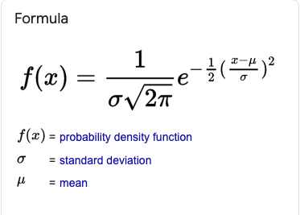

### What Does Cross-Validation Mean?
Cross-validation is a technique that is used for the assessment of how the results of statistical analysis generalize to an independent data set. Cross-validation is largely used in settings where the target is prediction and it is necessary to estimate the accuracy of the performance of a predictive model. The prime reason for the use of cross-validation rather than conventional validation is that there is not enough data available for partitioning them into separate training and test sets (as in conventional validation). This results in a loss of testing and modeling capability.

Cross-validation is also known as rotation estimation.

### Explain the steps for a Data analytics project

1. Understand the business issue
2. Understand your data set
3. Prepare the data
4. Perform exploratory analysis and modeling
5. Validate your data
6. Visualize and present your findings

### Discuss Artificial Neural Networks

An artificial neural network (ANN) is the piece of a computing system designed to simulate the way the human brain analyzes and processes information. It is the foundation of artificial intelligence (AI) and solves problems that would prove impossible or difficult by human or statistical standards.

### What is Back Propagation?

backward propagation of errors

> Backpropagation, short for "backward propagation of errors," is an algorithm for supervised learning of artificial neural networks using gradient descent. ... Partial computations of the gradient from one layer are reused in the computation of the gradient for the previous layer.

Back-propagation is just a way of propagating the total loss back into the neural network to know how much of the loss every node is responsible for, and subsequently updating the weights in such a way that minimizes the loss by giving the nodes with higher error rates lower weights and vice versa.

### What is a Random Forest?

Random forest, like its name implies, consists of a large number of individual decision trees that operate as an ensemble. Each individual tree in the random forest spits out a class prediction and the class with the most votes becomes our model’s prediction

### What is the importance of having a selection bias?
Selection Bias occurs when there is no appropriate randomization acheived while selecting individuals, groups or data to be analysed.Selection bias implies that the obtained sample does not exactly represent the population that was actually intended to be analyzed.Selection bias consists of Sampling Bias, Data, Attribute and Time Interval.

### Explain the difference between Data Science and Data Analytics

Data analytics is more specific and concentrated than data science. Data analytics focuses more on viewing the historical data in context while data science focuses more on machine learning and predictive modeling. ... On the other hand, data analytics involves a few different branches of broader statistics and analysis.

### What are the important libraries of Python that are used in Data Science?

* TensorFlow.
* NumPy.
* SciPy.
* Matplotlib.
* Pandas.
* Keras.
* SciKit-Learn.
* Statsmodels.
* Plotly
* Seaborn
  
### What is Interpolation and Extrapolation?
Estimating a value from 2 known values from a list of values is Interpolation. Extrapolation is approximating a value by extending a known set of values or facts. ... Interpolation is an estimation of a value within two known values in a sequence of values.

### How can the outlier values be treated?
### How often should an algorithm be updated?
It never happens that the final ML model deployed once takes away the worries forever and keeps giving accurate predictions.

Why is that? Lets figure out below:

1. Model Drift:
To understand this, let us recall one of the most critical assumptions in ML modelling — train and test dataset should belong to similar distribution. And, the model will be good if the new data is similar to the data observed in the past on which the model was trained on.
So, we understand that if test data distribution deviates from that of train data, the model will not hold good. But what could be the possible reasons for such deviation. Well, it can be attributed to many reasons depending on the business case, e.g. change in consumer preferences, fast moving competitive space, geographic shift, economic conditions etc.
Hence, the drifting data distribution calls for an ongoing process of periodically checking the validity of old model. In short, it is critical to keep your machine learning model updated; but the key is when? We will discuss this and a lot more as we proceed, so stay tuned.

2. Robustness:
   People/entities that get affected by the outcome of the ML models may deliberately alter their response in order to send spurious input to the model, thereby escaping the impact of the model predictions. For example, the models such as fraud detection, cyber-security etc receive manipulated and distorted inputs which cause model to output misclassified predictions. Such type of adversaries also drives down the model performance.
3. When ground truth is not available at the time of model training:
   In most of the machine learning models, the ground truth labels are not available to train the model. For example, target variable which captures the response of the end user is not known. In that case, your best bet could be to mock the user action based on certain set of rules coming from business understanding or leverage the open source dataset to initiate model training. But, this model might not necessarily represent the actual data and hence will not perform well until a burn-in period where it starts picking (aka learning) the true actions of the end user. 

What all comes under the scope of model retraining?
* Updating the model parameters?
* Reiterating over the hyper-parameter search space
* Re-running the model selection pipeline across the candidate pool of algorithms
* If that also does not uptick the model performance, then do we need to introduce new features into the model, maybe re-do the feature engineering and selection pipeline?

Lets look at some of the ways to assess the distribution drift:

* **Histogram**: A quick way to visualize the comparison is to draw the histogram — the degree of overlap between the two histograms gives a measure of similarity.
* **K-S statistic**: To check if the upcoming new data belongs to the same distribution as that of training data.
* **Target Distribution**: One quick way to check the consistent predictive power of the ML model is to examine the distribution of the target variable. For example, if your training dataset is imbalanced with 99% data belonging to class 1 and remaining 1% to class 0. And, the predictions reflect this distribution to be around 90%-10%, then it should be treated as an alert for further investigation.
* **Correlation**: Monitoring pairwise correlations between individual predictors will help bring out the underlying drift

### Define the term deep learning
Deep learning is a type of machine learning and artificial intelligence (AI) that imitates the way humans gain certain types of knowledge. Deep learning is an important element of data science, which includes statistics and predictive modeling.

### What is Normal Distribution

In probability theory, a normal distribution is a type of continuous probability distribution for a real-valued random variable

### Which language is best for text analytics? R or Python?
Python
### Explain the benefits of using statistics by Data Scientists
Get meaningful insight from data
### Name various types of Deep Learning Frameworks
* TensorFlow. Google's open-source platform TensorFlow is perhaps the most popular tool for Machine Learning and Deep Learning. ...
* PyTorch. PyTorch is an open-source Deep Learning framework developed by Facebook. ...
* Keras. ...
* Sonnet. ...
* MXNet. ...
* Swift for TensorFlow. ...
* Gluon. ...
* DL4J.

### What is skewed Distribution & uniform distribution?
Skewed distribution is a condition when one side (either right or left) of the graph has more dataset in comparison to the other side. Uniform distribution is a condition when all the observations in a dataset are equally spread across the range of distribution.

### What is reinforcement learning?
Reinforcement learning is an area of Machine Learning. It is about taking suitable action to maximize reward in a particular situation. ... In the absence of a training dataset, it is bound to learn from its experience. Example: The problem is as follows: We have an agent and a reward, with many hurdles in between

### What is precision?

Precision is defined as the number of true positives divided by the number of true positives plus the number of false positives. ... While recall expresses the ability to find all relevant instances in a dataset, precision expresses the proportion of the data points our model says was relevant actually were relevant.

### Do you prefer Python or R for text analytics?

Python

### What is Cluster Sampling?

Cluster sampling is a probability sampling method in which you divide a population into clusters, such as districts or schools, and then randomly select some of these clusters as your sample. ... In single-stage sampling, you collect data from every unit within the selected clusters.

### Regression Model Accuracy Metrics
Model performance metrics

In regression model, the most commonly known evaluation metrics include:

1. **R-squared (R2)**, which is the proportion of variation in the outcome that is explained by the predictor variables. In multiple regression models, R2 corresponds to the squared correlation between the observed outcome values and the predicted values by the model. The Higer the R-squared, the better the model.

2. **Root Mean Squared Error (RMSE)**, which measures the average error performed by the model in the predicting the outcome for an observation. Mathematically, the RMSE is the square root of the mean squared error (MSE), which is the average squared difference between the observed actual outcome values and the values predicted by the model. So, MSE = mean((observeds - predicteds)^2) and RMSE = sqrt(MSE). The lower the RMSE, the better the model.

3. **Residual Standard Error (RSE)**, also known as the model sigma, is a variant of the RMSE adjusted for the number of predictors in the model. The lower the RSE, the better the model. In practice, the difference between RMSE and RSE is very small, particularly for large multivariate data.

4. **Mean Absolute Error (MAE)**, like the RMSE, the MAE measures the prediction error. Mathematically, it is the average absolute difference between obsered and predicted out-comes, MAE = mean(abs(observeds - predicteds)) . MAE is less sensitive to outliers compared to RMSE.

The problem with the above metrics, is that they are sensible to the inclusion of additional variables in the model, even if those variables don’t have significant contribution in explaining the outcome. Put in other words, including additional variables in the model will always increase the R2 and reduce the RMSE. So, we need a more robust metric to guide the model choice.

Concerning R2, there is an adjusted version, called Adjusted R-squared, which adjusts the R2 for having too many variables in the model.

Additionally, there are four other important metrics - AIC, AICc, BIC and Mallows Cp - tha are commonly used for model evaluation and selection. These are an unbiased estimate of the model prediction error MSE. The lower these metrics, he better the model.

1. **AIC stands for (Akike’s Information Criteria)**, a metric developeed by the Japanese Statistician, Hirotugu Akaike, 1970. The basic idea of AIC is to penalize the inclusion of additional variables to a model. It adds a penalty that increases the error when including additional terms. The lowwer the AIC, the better the model.

2. **AICc** is a version of AIC corrected for small sample sizes.

3. **BIC (or Bayesian information criteria)** is a variant of AIC with a strong penalty for including additional variables to the model.

4. **Mallows Cp**: Avariant of AIC developed by Colin Mallows.

Generally, most commonly used metrics, for measuring regression model quality and comparing models, are: Adjusted R2, AIC, BIC and Cp

1. Know what a p-value is and its limitations in decisions.
2. Linear regression and its assumptions.
3. When to use different statistical distributions.
4. How an effect size impacts results/decisions.
5. Mean, variance for Normal, Uniform, Poisson.
6. Sampling techniques and common designs (e.g. A/B).
7. Bayes' theorem (applied calculations).
8. Common conjugate priors (Bayesian stats).
9. Logistic regression and ROC curves.
10. Resampling (Cross validation + bootstrapping).
11. Dimensionality reduction.
12. Tree-based models (particularly how to prune)
13. Ridge and Lasso for regression.

1. Nail your linear regression and its assumptions.
2. Update your knowledge of window functions.
3. Learn about approaches for missing values.
4. Cut your last presentation slide count by 50%.
5. Try to change some words into a visual.
6. Read your company's latest earnings.
7. Speak up when you usually wouldn't have.
8. Get familiar with the data tables you use.
9. Get to know 2 new people.
10. Don't try to do all of these at once!

Leetcode SQL Link: https://lnkd.in/g3c5JGC

1. Second highest salary problem: https://lnkd.in/erz9tM2

2. Duplicate emails: https://lnkd.in/eF9NJ4w

3. Classes with more than 5 students: https://lnkd.in/enYntdq

4. Rising temperature: https://lnkd.in/eEe3k-k

5. Department top 3 salaries (this one is hard): https://lnkd.in/e-SmKD4

1. Knowing how to properly use a t-test.
2. Explaining the meaning of a p-value to a non-tech audience.
3. Using WHERE and HAVING properly.
4. Designing a good A/B test so that stats are easy.
5. Defining SQL subqueries in the appropriate cases.
6. Checking the assumptions of linear models.
7. Understanding how to take a simple random sample.
8. Explaining confidence and/or credible intervals.
9. Ability to say in 5 minutes what you could say in 30 min.
10. Never thinking you've got it all down. Review the basics.

