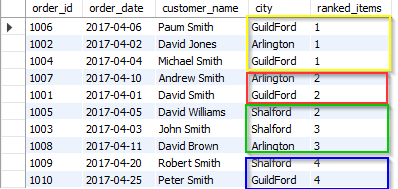
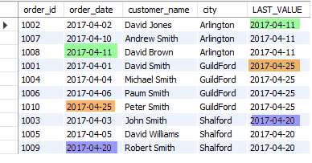

# SQL Interview Preparation
---
---

### Cast Functions and Operators


|Name      |Description                           |
|----------|--------------------------------------|
|BINARY    |   CAST a string to binary string     |
|Row2CAST()|   Cast a value as a certain type     |
|CONVERT() |   Cast a value as a certain type     |


### SQL | WITH clause

- The clause is used for defining a temporary relation such that the output of this temporary relation is available and is used by the query that is associated with the WITH clause.
- Queries that have an associated WITH clause can also be written using nested sub-queries but doing so add more complexity to read/debug the SQL query.
- WITH clause is not supported by all database system.
- The name assigned to the sub-query is treated as though it was an inline view or table
- The SQL WITH clause was introduced by Oracle in the Oracle 9i release 2 database.

```sql
WITH temporaryTable (averageValue) as
    (SELECT avg(Attr1)
    FROM Table)
    SELECT Attr1
    FROM Table
    WHERE Table.Attr1 > temporaryTable.averageValue;
```
Example 1:  Find all the employee whose salary is more than the average salary of all employees. 

Name of the relation: Employee 

<table><tbody><tr><th>EmployeeID</th><th>Name</th><th>Salary</th></tr><tr><th>100011</th><th>Smith</th><th>50000</th></tr><tr><th>100022</th><th>Bill</th><th>94000</th></tr><tr><th>100027</th><th>Sam</th><th>70550</th></tr><tr><th>100845</th><th>Walden</th><th>80000</th></tr><tr><th>115585</th><th>Erik</th><th>60000</th></tr><tr><th>1100070</th><th>Kate</th><th>69000</th></tr></tbody></table>

**SQL Query**
```sql
WITH tempamount(customer_id, totalamount)
     AS (SELECT customer_id,
                Sum(amount)
         FROM   payment
         GROUP  BY customer_id),
     avgamount(averageamount)
     AS (SELECT Avg(amount)
         FROM   payment)
SELECT customer_id,
       totalamount
FROM   tempamount,
       avgamount
WHERE  tempamount.totalamount > avgamount.averageamount 
```

__Output__

<table><tbody><tr><th>EmployeeID</th><th>Name</th><th>Salary</th></tr><tr><th>100022</th><th>Bill</th><th>94000</th></tr><tr><th>100845</th><th>Walden</th><th>80000</th></tr></tbody></table>

**Explanation**: The average salary of all employees is 70591. Therefore, all employees whose salary is more than the obtained average lies in the output relation. 


**Example 2**: Find all the airlines where the total salary of all pilots in that airline is more than the average of total salary of all pilots in the database. 

Name of the relation: **Pilot** 

<table><tbody><tr><th>EmployeeID</th><th>Airline</th><th>Name</th><th>Salary</th></tr><tr><th>70007</th><th>Airbus 380</th><th>Kim</th><th>60000</th></tr><tr><th>70002</th><th>Boeing</th><th>Laura</th><th>20000</th></tr><tr><th>10027</th><th>Airbus 380</th><th>Will</th><th>80050</th></tr><tr><th>10778</th><th>Airbus 380</th><th>Warren</th><th>80780</th></tr><tr><th>115585</th><th>Boeing</th><th>Smith</th><th>25000</th></tr><tr><th>114070</th><th>Airbus 380</th><th>Katy</th><th>78000</th></tr></tbody></table>


**SQL Query:**

```sql
WITH tempamount(customer_id, totalamount)
     AS (SELECT customer_id,
                Sum(amount)
         FROM   payment
         GROUP  BY customer_id),
     avgamount(averageamount)
     AS (SELECT Avg(amount)
         FROM   payment)
SELECT customer_id,
       totalamount
FROM   tempamount,
       avgamount
WHERE  tempamount.totalamount > avgamount.averageamount 
```

**Question**: Count distinct on two columns


```sql
WITH distinctcustid(distinctcustomercount)
     AS (SELECT Count(DISTINCT( customer_id ))
         FROM   sakila.payment),
     distinctstaffid(distinctstaffcount)
     AS (SELECT Count(DISTINCT( staff_id ))
         FROM   sakila.payment)
SELECT distinctcustomercount,
       distinctstaffcount
FROM   distinctcustid,
       distinctstaffid 
```

**Question**: Difference between _UNION_ and _UNIOINALL_ ?

The only difference between Union and Union All is that Union extracts the rows that are being specified in the query while Union All extracts all the rows including the duplicates (repeated values) from both the queries


### Window Functions

**Types of Window functions**
- Aggregate Window Functions. SUM(), MAX(), MIN(), AVG(). COUNT()
- Ranking Window Functions. RANK(), DENSE_RANK(), ROW_NUMBER(), NTILE()
- Value Window Functions. LAG(), LEAD(), FIRST_VALUE(), LAST_VALUE()


```sql

window_function ( [ ALL ] expression ) 
OVER ( [ PARTITION BY partition_list ] [ ORDER BY order_list] )
```

#### Arguments

**window_function**

Specify the name of the window function

**ALL**

ALL is an optional keyword. When you will include ALL it will count all values including duplicate ones. DISTINCT is not supported in window functions

**expression**

The target column or expression that the functions operates on. In other words, the name of the column for which we need an aggregated value. For example, a column containing order amount so that we can see total orders received.

**OVER**

Specifies the window clauses for aggregate functions.

**PARTITION BY partition_list**

Defines the window (set of rows on which window function operates) for window functions. We need to provide a field or list of fields for the partition after PARTITION BY clause. Multiple fields need be separated by a comma as usual. If PARTITION BY is not specified, grouping will be done on entire table and values will be aggregated accordingly.

**ORDER BY order_list**
Sorts the rows within each partition. If ORDER BY is not specified, ORDER BY uses the entire table.


#### Example

Create a table

```sql
CREATE TABLE Orders2
(
	order_id INT,
	order_date DATE,
	customer_name VARCHAR(250),
	city VARCHAR(100),	
	order_amount DECIMAL
);
 
INSERT INTO Orders2 (
	order_id ,
	order_date ,
	customer_name,
	city ,	
	order_amount
)
SELECT '1002',STR_TO_DATE('04-02-2017', '%m-%d-%Y'),'David Jones','Arlington',20000
UNION ALL	  
SELECT '1003',STR_TO_DATE('04-03-2017', '%m-%d-%Y'),'John Smith','Shalford',5000
UNION ALL	  
SELECT '1004',STR_TO_DATE('04-04-2017', '%m-%d-%Y'),'Michael Smith','GuildFord',15000
UNION ALL	  
SELECT '1005',STR_TO_DATE('04-05-2017', '%m-%d-%Y'),'David Williams','Shalford',7000
UNION ALL	  
SELECT '1006',STR_TO_DATE('04-06-2017', '%m-%d-%Y'),'Paum Smith','GuildFord',25000
UNION ALL	 
SELECT '1007',STR_TO_DATE('04-10-2017', '%m-%d-%Y'),'Andrew Smith','Arlington',15000
UNION ALL	  
SELECT '1008',STR_TO_DATE('04-11-2017', '%m-%d-%Y'),'David Brown','Arlington',2000
UNION ALL	  
SELECT '1009',STR_TO_DATE('04-20-2017', '%m-%d-%Y'),'Robert Smith','Shalford',1000
UNION ALL	  
SELECT '1010',STR_TO_DATE('04-25-2017', '%m-%d-%Y'),'Peter Smith','GuildFord',500
```

#### Aggregate Window Functions

**SUM()**

Order Table


**Query** Get sum of _order\_amount_ per city

```sql
SELECT *,
       Sum(order_amount) OVER(PARTITION BY city) AS total_amount
FROM   orders2 
```

**Output**


> Same type of syntax can be used for _AVG()_, _MIN()_, _MAX()_, _COUNT()_

**AVG()**

```sql
SELECT *,
       AVG(order_amount) OVER(PARTITION BY city) AS avg_amount
FROM   orders2 
```


**MIN()**

```sql
SELECT *,
       MIN(order_amount) OVER(PARTITION BY city) AS min_amount
FROM   orders2 
```


**MAX()**

```sql
SELECT *,
       MAX(order_amount) OVER(PARTITION BY city) AS max_amount
FROM   orders2 
```


**COUNT()**

```sql
SELECT *, COUNT(order_id) OVER(PARTITION BY city) as total_id
FROM orders2
```


### Ranking Functions

**RANK(), DENSE_RANK(), ROW_NUMBER(), NTILE()**


**RANK()**

The RANK() function is used to give a unique rank to each record based on a specified value, for example salary, order amount etc.

If two records have the same value then the RANK() function will assign the same rank to both records by skipping the next rank. This means – if there are two identical values at rank 2, it will assign the same rank 2 to both records and then skip rank 3 and assign rank 4 to the next record.

Let’s rank each order by their order amount.

```sql
SELECT order_id, order_date, customer_name, city,
	RANK() OVER(ORDER BY order_amount DESC) ranked_items
FROM orders2
```


**DENSE_RANK()**

```sql
SELECT order_id, order_date, customer_name, city,
	DENSE_RANK() OVER(ORDER BY order_amount DESC) ranked_items
FROM orders2
```


_DENSE\_RANK()_ over city

```sql
SELECT order_id, order_date, customer_name, city,
	DENSE_RANK() OVER(PARTITION BY city ORDER BY order_amount DESC) ranked_items
FROM orders2;
```


**ROW_NUMBER**

```sql
SELECT order_id, order_date, customer_name, city,
	ROW_NUMBER() OVER(ORDER BY order_amount DESC) `row_number`
FROM orders2
```


**NTILE()**

NTILE() is a very helpful window function. It helps you to identify what percentile (or quartile, or any other subdivision) a given row falls into.

This means that if you have 100 rows and you want to create 4 quartiles based on a specified value field you can do so easily and see how many rows fall into each quartile.

Let’s see an example. In the query below, we have specified that we want to create four quartiles based on order amount. We then want to see how many orders fall into each quartile.


```sql
SELECT order_id, order_date, customer_name, city,
	NTILE(4) OVER(ORDER BY order_amount DESC) ranked_items
FROM orders2;
```




#### Value Window Functions

Value window functions are used to find first, last, previous and next values. The functions that can be used are *LAG(), LEAD(), FIRST_VALUE(), LAST_VALUE()*

**LAG()**

```sql
SELECT order_id, customer_name, city,order_date,
	LAG(order_date, 1) OVER(ORDER BY order_amount DESC) `LAG`
FROM orders2;
```


**LEAD()**

```sql
SELECT order_id, customer_name, city, order_date,
	LEAD(order_date, 1) OVER(ORDER BY order_amount DESC) `LEAD`
FROM orders2;
```


**FIRST_VALUE()**

```sql
SELECT order_id, order_date, customer_name, city,
	FIRST_VALUE(order_date) OVER(PARTITION BY city ORDER BY city) `FIRST_VALUE`
FROM orders2;
```


**LAST_VALUE()**

```sql
SELECT order_id, order_date, customer_name, city,
	LAST_VALUE(order_date) OVER(PARTITION BY city ORDER BY city) `LAST_VALUE`
FROM orders2
```





### Common Table Expression

A Common Table Expression, also called as CTE in short form, is a temporary named result set that you can reference within a SELECT, INSERT, UPDATE, or DELETE statement. The CTE can also be used in a View.

**Difference between _nested query_ and _CTE_**

In the sub-query vs simple (non-recursive) CTE versions, they are probably very similar. You would have to use the profiler and actual execution plan to spot any differences, and that would be specific to your setup (so we can't tell you the answer in full).

In general; A CTE can be used recursively; a sub-query cannot. This makes them especially well suited to tree structures.

**Syntax**

```sql
WITH expression_name [ ( column_name [,...n] ) ] 
AS 
( CTE_query_definition )
```

**To view the CTE result we use a Select query with the CTE expression name.**

```sql
Select [Column1,Column2,Column3 …..] from expression_name
```

or

```sql
Select * from expression_name
```

#### Common Table Expression (CTE) Types

**Non-Recursive CTEs**

Non-Recursive CTEs are simple where the CTE doesn’t use any recursion, or repeated processing in of a sub-routine. We will create a simple Non-Recursive CTE to display the row number from 1 to 10.

As per the CTE Syntax each CTE query will start with a “With” followed by the CTE Expression name with column list.

Here we have been using only one column as ROWNO. Next is the Query part, here we write our select query to be execute for our CTE. After creating our CTE query to run the CTE use the select statement with CTE Expression name.

```sql
;with ROWCTE(ROWNO) as  
   (  
     SELECT 
  ROW_NUMBER() OVER(ORDER BY name ASC) AS ROWNO
FROM sys.databases 
WHERE database_id <= 10
    )  
 
SELECT * FROM ROWCTE 
```


## CASE Statement

**Searched CASE in SELECT (Matches a boolean expression)**

```sql
SELECT Id, itemId, Price,
    CASE WHEN Price < 10 THEN 'CHEAP'
         WHEN Price < 20 THEN 'AFFORDABLE'
         ELSE 'EXPENSIVE'
    END AS PriceRating
FROM ItemSales
```

**Use CASE to COUNT the number of rows in a column match a condition.**

```sql
SELECT
    COUNT(ID) AS ItemsCount,
    SUM(CASE
            WHEN PriceRating = 'Expensive' THEN 1
            ELSE 0
        END
        ) AS ExpensiveItemsCount
FROM ItemSales
```


**Shorthand CASE in SELECT**

Shorthand variant evaluates an expression (usually a column) against a series of values.
This variant is a bit shsorter, and saves repeating evaluated expression over and over again.
The _ELSE_ clause can still be used though:

```sql
SELECT Id, ItemId, Price,
    CASE Price WHEN 5 THEN 'CHEAP'
               WHEN 15 THEN 'AFFORDABLE'
               ELSE         'EXPENSIVE'
    END as PriceRating
FROM ItemSales
```

**CASE in a clause ORDER BY**

```sql
SELECT * FROM DEPT
ORDER BY
    CASE DEPARTMENT
        WHEN 'MARKETING' THEN 1
        WHEN 'SALES' THEN 2
        WHEN 'RESEARCH' THEN 3
        WHEN 'INNOVATION' THEN 4
        ELSE 5
    END, CITY
```

**Using CASE in UPDATE**

```sql
UPDATE ItemPrice
SET Price = Price *
    CASE ItemId
        WHENN 1 THEN 1.05
        WHENN 2 THEN 1.10
        WHENN 3 THEN 1.15
        ELSE 1.00
    END
```

**Recursive CTE**

```sql
With
  EmployeesCTE (EmployeeId, Name, ManagerId, [Level])
  as
  (
    Select EmployeeId, Name, ManagerId, 1
    from tblEmployee
    where ManagerId is null
    
    union all
    
    Select tblEmployee.EmployeeId, tblEmployee.Name, 
    tblEmployee.ManagerId, EmployeesCTE.[Level] + 1
    from tblEmployee
    join EmployeesCTE
    on tblEmployee.ManagerID = EmployeesCTE.EmployeeId
  )
Select EmpCTE.Name as Employee, Isnull(MgrCTE.Name, 'Super Boss') as Manager, 
EmpCTE.[Level] 
from EmployeesCTE EmpCTE
left join EmployeesCTE MgrCTE
on EmpCTE.ManagerId = MgrCTE.EmployeeId
```

OR

```sql
WITH RECURSIVE ManagedByJames(Level, ID, FName, LName) AS(
    --Start with this row
    SELECT 1, ID, FName, LName
    FROM Employees
    WHERE ID = 1

    UNION ALL
    -- get employees that have any of the previously selected rows as manager
    SELECT ManagedByJames.Level + 1,
           Employees.ID,
           Employees.FName,
           Employees.LName
    FROM Employees
    JOIN ManagedByJames
        ON Employees.ManagerID = ManagedByJames.ID
    ORDER BY 1 DESC -- depth-first search
)
SELECT * FROM ManagedByJames;
```


## Create a new function

CREATE FUNCTION create as user-defined function that can be used when doing a SELECT, INSERT, UPDATE, or DELETE query. The functions can be created to return a single variable or a single table

Examples

Create a new Function

```sql
CREATE FUNCTION FirstWord(@input varchar(1000))
RETURNS varchar(1000)
AS
BEGIN
    DECLARE @outut varchar(10000)
    SET @output = SUBSTRING(@input, 0, CASE CHARINDEX(' ', @input))
        WHEN 0 THEN LEN(@input) + 1
        ELSE CHARINDEX(' ', @input)
    END)
    RETURN @output
END

```


1. CUME_DIST (Transact-SQL)
1. FIRST_VALUE (Transact-SQL)
1. LAG (Transact-SQL)
1. LAST_VALUE (Transact-SQL)
1. LEAD (Transact-SQL)
1. PERCENT_RANK (Transact-SQL)
1. PERCENTILE_CONT (Transact-SQL)
1. PERCENTILE_DISC (Transact-SQL)


**Useful aggregate functions:**

1. AVG() - Returns the average value
1. COUNT() - Returns the number of rows
1. FIRST() - Returns the first value
1. LAST() - Returns the last value
1. MAX() - Returns the largest value
1. MIN() - Returns the smallest value
1. SUM() - Returns the sum


**Useful scalar functions:**

1. UCASE() - Converts a field to upper case
1. LCASE() - Converts a field to lower case
1. MID() - Extract characters from a text field
1. LEN() - Returns the length of a text field
1. ROUND() - Rounds a numeric field to the number of decimals specified
1. NOW() - Returns the current system date and time
1. FORMAT() - Formats how a field is to be displayed


1. CAST
2. CONVERT
3. PARSE
4. DATENAME
5. GETDATE()
6. DATEADD()
7. CHOOSE
8.  IIF
9. SIGN
10. POWER


### Materialized View

A Materialized View persists the data returned from the view definition query and automatically gets updated as data changes in the underlying tables. It improves the performance of complex queries (typically queries with joins and aggregations) while offering simple maintenance operations. With its execution plan automatching capability, a materialized view does not have to be referenced in the query for the optimizer to consider the view for substitution. This capability allows data engineers to implement materialized views as a mechanism for improving query response time, without having to change queries.

**Syntax:**

```sql
CREATE MATERIALIZED VIEW [ schema_name. ] materialized_view_name
    WITH (  
      <distribution_option>
    )
    AS <select_statement>
[;]

<distribution_option> ::=
    {  
        DISTRIBUTION = HASH ( distribution_column_name )  
      | DISTRIBUTION = ROUND_ROBIN  
    }

<select_statement> ::=
    SELECT select_criteria
```


### Execution Order

