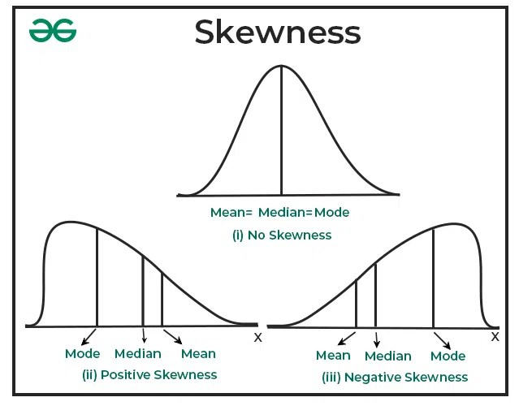

DESCRIPTIVE AND INFERENTIAL STATISTICS
---

### **Descriptive and Inferential Statistics:**

In statistics, **descriptive** and **inferential statistics** are two key branches that help us make sense of data. Each has a distinct purpose and set of methods.

---

### **1. Descriptive Statistics:**

**Purpose:** Descriptive statistics aim to summarize, organize, and simplify large amounts of data into manageable forms that give insights about the data without drawing conclusions beyond the dataset itself.

- **Used for:** Providing a clear snapshot of the data.
- **Focus:** Describing the characteristics of the dataset.

#### **Key Components of Descriptive Statistics:**

1. **Measures of Central Tendency:**
   - These describe the center of the data distribution.
     - **Mean:** The average value.
     - **Median:** The middle value when data is ordered.
     - **Mode:** The most frequent value.

   **Example:**
   If we have the data points: [1, 2, 2, 3, 4]
   - **Mean:** (1 + 2 + 2 + 3 + 4) / 5 = 2.4
   - **Median:** 2
   - **Mode:** 2 (appears most frequently)

2. **Measures of Dispersion:**
   - These describe the spread or variability in the data.
     - **Range:** Difference between the maximum and minimum values.
     - **Variance:** The average of the squared differences from the mean.
     - **Standard Deviation:** The square root of the variance. It provides an understanding of how much the data deviate from the mean.

   **Example:**
   If we have the data points: [1, 2, 2, 3, 4]
   - **Range:** 4 - 1 = 3
   - **Variance:** 1.3
   - **Standard Deviation:** 1.14

3. **Shape of the Data Distribution:**
   - **Skewness:** Measures the asymmetry of the distribution.
     - **Right-skewed (Positive skewness):** Tail is on the right side (e.g., income data).
     - **Left-skewed (Negative skewness):** Tail is on the left side.
   - **Kurtosis:** Measures the "tailedness" of the distribution (sharp peak vs. flat peak).

4. **Percentiles and Quartiles:**
   - **Percentiles:** Describe the percentage of data below a certain value (e.g., 50th percentile is the median).
   - **Quartiles:** Divide data into four equal parts:
     - **Q1 (25th percentile):** Lower quartile.
     - **Q2 (50th percentile):** Median.
     - **Q3 (75th percentile):** Upper quartile.
   - **Interquartile Range (IQR):** Q3 - Q1, measures the spread of the middle 50% of the data.

#### **Visualization Tools:**
- **Histograms:** Show frequency distribution.
- **Bar Charts:** Display categorical data.
- **Box Plots:** Show median, quartiles, and outliers.
- **Scatter Plots:** Show relationships between two variables.

#### **Example of Descriptive Statistics in Action:**
Suppose you are analyzing the test scores of students in a class:
- **Mean:** 75
- **Median:** 78
- **Standard Deviation:** 10 (shows how spread out the scores are)
- **Skewness:** Slightly left-skewed (more students scored higher than the mean)

In **descriptive statistics**, you are simply summarizing the data, not making any predictions or inferences.

---

### **2. Inferential Statistics:**

**Purpose:** Inferential statistics go beyond merely describing the data. It allows you to make conclusions or **inferences** about a population based on a sample of data.

- **Used for:** Making predictions, estimations, and testing hypotheses.
- **Focus:** Drawing conclusions about a larger population from a sample.

#### **Key Components of Inferential Statistics:**

1. **Sampling:**
   - A sample is a subset of the population. Inferential statistics uses samples to make predictions about the population.
   - **Random sampling** ensures that every member of the population has an equal chance of being selected.

2. **Estimation:**
   - **Point Estimation:** Estimating a population parameter (e.g., population mean) using a single value based on sample data.
   - **Interval Estimation:** Calculating an interval within which the population parameter is likely to lie (e.g., confidence intervals).

   **Example:** You may estimate that the average height of a population is 170 cm, but you also give a confidence interval of 168 cm to 172 cm, meaning you are confident the true average lies within that range.

3. **Hypothesis Testing:**
   - **Null Hypothesis (H₀):** Assumes no effect or no difference.
   - **Alternative Hypothesis (H₁):** Assumes there is an effect or a difference.
   - A test (e.g., t-test, ANOVA, chi-square) is performed to decide whether to reject or fail to reject the null hypothesis.

   **Key Concepts in Hypothesis Testing:**
   - **P-value:** The probability of observing the test results under the null hypothesis. A small p-value (typically less than 0.05) indicates that you should reject the null hypothesis.
   - **Type I Error:** Rejecting the null hypothesis when it is actually true (false positive).
   - **Type II Error:** Failing to reject the null hypothesis when it is actually false (false negative).

4. **Confidence Intervals:**
   - A range of values used to estimate the true value of a population parameter. For example, a 95% confidence interval means that if you repeated the experiment many times, the true parameter would lie within this interval in 95% of the cases.

   **Example:** Estimating the mean height of a population is 170 cm with a 95% confidence interval of [168 cm, 172 cm].

5. **Regression Analysis:**
   - **Simple Linear Regression:** Examines the relationship between two continuous variables.
   - **Multiple Linear Regression:** Explores the relationship between one dependent variable and multiple independent variables.
   - **Logistic Regression:** Used for classification tasks (e.g., predicting binary outcomes).

   **Example:** Predicting house prices based on features like square footage, location, and number of bedrooms using linear regression.

#### **Example of Inferential Statistics in Action:**
Suppose you want to estimate the average salary of data scientists in a country:
- You collect a **sample** of 500 data scientists’ salaries.
- Using **inferential statistics**, you can estimate the **mean salary** of all data scientists and calculate a **confidence interval** around this estimate.
- You can also perform a **hypothesis test** to see if the average salary is significantly different from another country's average.

---

### **Key Differences Between Descriptive and Inferential Statistics:**

| **Feature**            | **Descriptive Statistics**                                        | **Inferential Statistics**                                             |
|------------------------|------------------------------------------------------------------|-----------------------------------------------------------------------|
| **Purpose**            | Summarize and describe data.                                      | Make predictions or inferences about a population based on a sample.  |
| **Focus**              | Describing the characteristics of a dataset.                     | Drawing conclusions beyond the dataset.                               |
| **Methods Used**       | Measures of central tendency, dispersion, and distribution.       | Estimation, hypothesis testing, regression, confidence intervals.      |
| **Data Scope**         | Works with entire dataset (population or sample).                 | Works with a sample to infer about the population.                     |
| **Typical Output**     | Mean, median, mode, variance, standard deviation, percentiles.    | P-values, confidence intervals, regression coefficients, test results. |
| **Examples**           | Describing average height or test scores in a sample.             | Estimating average height or salary of a population from a sample.     |

---

### **Components to Prepare for an Interview:**

When preparing for an interview on statistics, here are key concepts and topics you should be well-versed in:

#### **1. Descriptive Statistics:**
- Understand measures of central tendency (mean, median, mode).
- Know measures of dispersion (variance, standard deviation, range).
- Be familiar with concepts like skewness and kurtosis.
- Understand different types of data (nominal, ordinal, interval, ratio).
- Know how to use visualizations like histograms, box plots, and scatter plots.

#### **2. Inferential Statistics:**
- **Sampling Methods:** Random sampling, stratified sampling, etc.
- **Estimation:** Point estimates and confidence intervals.
- **Hypothesis Testing:**
  - Null and alternative hypotheses.
  - P-value interpretation.
  - Type I and Type II errors.
  - Understanding of common tests like t-test, ANOVA, chi-square test.
- **Regression Analysis:**
  - Simple and multiple linear regression.
  - Assumptions of linear regression.
  - Logistic regression for classification problems.
- **Correlation vs. Causation:** Understand the difference and when each applies.
- **Statistical Significance:** What p-values and confidence intervals mean in practice.
  
#### **3. Key Probability Concepts:**
- **Basic Probability Theory:** Probability rules, conditional probability, independence.
- **Distributions:**
  - Normal distribution, t-distribution, chi-square distribution.
  - Understand probability density functions and cumulative distribution functions.
- **Central Limit Theorem:** Know its importance in inferential statistics.
- **Bayesian Statistics:** Familiarity with the concept of updating beliefs using Bayes’ theorem (optional but beneficial

).

#### **4. Common Tools:**
- **Software:** Be comfortable with tools like R, Python (NumPy, pandas, SciPy), and Excel for performing statistical analysis.
- **Libraries for Visualization:** Seaborn, Matplotlib (in Python), ggplot (in R).

#### **5. Practical Application:**
- Be ready to discuss examples from real-world projects where you applied descriptive or inferential statistics.
- Prepare to answer questions on how to handle missing data, outliers, or imbalanced datasets.

---

By mastering these topics, you will be well-prepared for interviews involving statistics and data analysis.

### **5. Skewness:**

### Type I and Type II error Examples

In statistics, Type I and Type II errors are concepts related to hypothesis testing. Here's a brief overview of each along with examples:

### Type I Error (False Positive)
A Type I error occurs when the null hypothesis is rejected when it is actually true. In other words, it's the mistake of concluding that there is an effect or difference when, in reality, there is none.

**Example 1**: A medical test for a disease
- Null Hypothesis (H0): The patient does not have the disease.
- Alternative Hypothesis (H1): The patient has the disease.
- **Type I Error**: The test indicates that the patient has the disease when they actually do not (the test returns a positive result falsely).

**Example 2**: A new drug's effectiveness
- Null Hypothesis (H0): The new drug has no effect on patients.
- Alternative Hypothesis (H1): The new drug improves patient outcomes.
- **Type I Error**: Concluding that the new drug is effective when it is not (the trial shows a statistically significant positive effect when there isn't one).

### Type II Error (False Negative)
A Type II error occurs when the null hypothesis is not rejected when it is actually false. This means failing to detect an effect or difference when one actually exists.

**Example 1**: A medical test for a disease
- Null Hypothesis (H0): The patient does not have the disease.
- Alternative Hypothesis (H1): The patient has the disease.
- **Type II Error**: The test indicates that the patient does not have the disease when they actually do (the test returns a negative result falsely).

**Example 2**: A new drug's effectiveness
- Null Hypothesis (H0): The new drug has no effect on patients.
- Alternative Hypothesis (H1): The new drug improves patient outcomes.
- **Type II Error**: Concluding that the new drug is not effective when it actually is (the trial fails to show a statistically significant positive effect when there is one).

### Summary
- **Type I Error** (False Positive): Incorrectly rejecting a true null hypothesis (e.g., saying a test is positive when it's not).
- **Type II Error** (False Negative): Failing to reject a false null hypothesis (e.g., saying a test is negative when it is actually positive). 

Both types of errors are important to consider in the design and interpretation of hypothesis tests, as they can have significant implications in research, healthcare, and more.