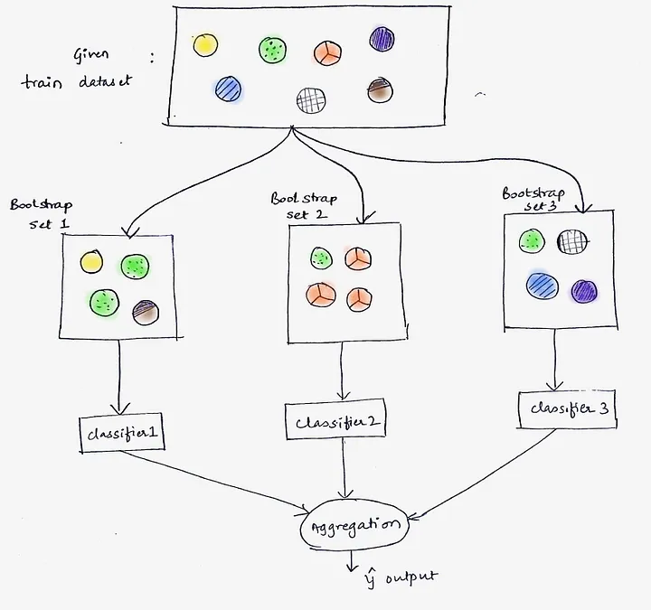
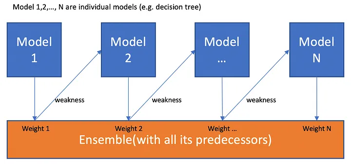

Machine Learning Notes
---

**Bagging** and **Boosting** are two popular ensemble learning techniques used to improve the accuracy, stability, and performance of machine learning models. Both methods combine the predictions of multiple base models (weak learners) to make a final prediction. However, they differ in how they build and combine the base models.

Let’s dive into both concepts in detail.

---

## **1. Bagging (Bootstrap Aggregating)**

### **Concept:**
- **Bagging** aims to reduce the **variance** of a model by training multiple models (weak learners) independently on different subsets of the data.
- It combines their predictions (often by averaging in regression or voting in classification) to produce a final output.
- Bagging works best with high-variance, low-bias models like **decision trees**.

### **How It Works:**
1. **Data Sampling:** Multiple subsets of the original dataset are generated using **bootstrapping**, where each subset is created by sampling the data **with replacement**.
2. **Training Multiple Models:** A model (usually the same type, like a decision tree) is trained on each subset independently.
3. **Averaging or Voting:** For regression, the predictions from all models are **averaged**. For classification, a **majority vote** is used to decide the final output.

### **Key Point:** Models are trained **independently**, and each model has **equal importance** in the final prediction.

### **Example:**
Suppose you are predicting house prices based on features like size, location, and number of rooms. Using bagging, you might:
- Create multiple bootstrapped datasets from the original data.
- Train separate decision trees on each dataset.
- Average the predictions from all trees to make a final prediction for the house price.

### **Advantages of Bagging:**
- **Reduces variance:** By training on different subsets of data, bagging reduces overfitting, especially with complex models like decision trees.
- **Parallelizable:** Each model is trained independently, so it can be parallelized.

### **Real-world Example: Random Forest**
- **Random Forest** is a popular bagging-based algorithm where the base learners are decision trees.
- In Random Forest, not only is the data bootstrapped, but a random subset of features is used at each split of the decision trees, making the model even more robust.

### **Visualization:**

---

## **2. Boosting**

### **Concept:**
- **Boosting** focuses on **reducing bias** by training models sequentially, with each model attempting to correct the errors made by the previous ones.
- Each subsequent model focuses on the **misclassified examples** from the previous model, making boosting a more **adaptive** method than bagging.

### **How It Works:**
1. **Sequential Learning:** Models are trained one after the other, and each model attempts to fix the mistakes made by the previous model.
2. **Weight Assignment:** In boosting, each data point is given a weight. Initially, all points have equal weight, but after each round, **misclassified** points are given **higher weight** so the next model focuses more on those errors.
3. **Combining Predictions:** The predictions of all the models are combined using a **weighted sum**. Models that perform well are given higher weight in the final prediction.

### **Key Point:** Models are trained **sequentially**, and each model is given **different importance** in the final prediction based on its performance.

### **Example:**
Suppose you are predicting customer churn (whether a customer will leave a service or not):
- Start by training a decision tree on the entire dataset. If some data points are misclassified, increase their importance (weight) for the next model.
- Train the next model, focusing more on the data points that were misclassified by the first model.
- Continue this process sequentially and combine the predictions from all models.

### **Advantages of Boosting:**
- **Reduces bias:** By focusing on the errors of previous models, boosting can achieve a high level of accuracy.
- **Good for complex models:** Boosting works well even with simple models like decision stumps (trees with one level) because it builds on their weaknesses.
  
### **Real-world Example: AdaBoost and Gradient Boosting**
- **AdaBoost (Adaptive Boosting):** Adjusts the weights of misclassified instances and assigns higher importance to models that perform well.
- **Gradient Boosting:** Focuses on reducing the errors in a gradient descent fashion by minimizing a loss function iteratively.

### **Visualization:**

---

## **Key Differences Between Bagging and Boosting**

| Feature | **Bagging** | **Boosting** |
| --- | --- | --- |
| **Objective** | Reduce **variance** by combining multiple models | Reduce **bias** by focusing on misclassified instances |
| **Model Training** | Models are trained **independently** and in **parallel** | Models are trained **sequentially**, each learning from the mistakes of the previous one |
| **Importance of Models** | All models have **equal weight** in final prediction | Models have **different weights** based on performance |
| **Data Subsampling** | Each model is trained on a different **bootstrapped subset** of the data | Each model is trained on the **same dataset**, but misclassified examples get more weight |
| **Examples of Algorithms** | Random Forest | AdaBoost, Gradient Boosting, XGBoost |
| **Best Suited For** | High-variance models like decision trees | High-bias models like decision stumps |

---

### **Detailed Examples**

### **1. Bagging Example (Random Forest for Classification)**
Imagine you are classifying emails as "spam" or "not spam." Using **Random Forest** (a bagging method):
- You create multiple bootstrapped samples of your email dataset.
- Train separate decision trees on each subset.
- Each decision tree classifies the email as "spam" or "not spam."
- The final decision is based on the **majority vote** from all the trees.

Here, each tree operates independently and has equal influence in the final decision.

### **2. Boosting Example (AdaBoost for Classification)**
Now, consider using **AdaBoost** for the same email classification task:
- Train a first simple decision tree (called a **decision stump**) on the entire dataset. It misclassifies some emails.
- Increase the weights of the misclassified emails so that the next decision stump pays more attention to them.
- Train another decision stump on the re-weighted data. This stump focuses on correcting the previous stump's errors.
- Repeat this process several times.
- Combine the results of all stumps, but give more weight to the better-performing ones.

Here, the later models learn from the mistakes of the earlier models, and each model has a different influence on the final output.

---

### **Conclusion:**
- **Bagging** is a technique for reducing **variance** and preventing overfitting by training models independently on different subsets of data.
- **Boosting** is a method for reducing **bias** by training models sequentially, where each model focuses on the errors of the previous ones.

Both methods improve model accuracy, but they are applied in different scenarios based on whether you're trying to reduce **variance** (Bagging) or **bias** (Boosting).